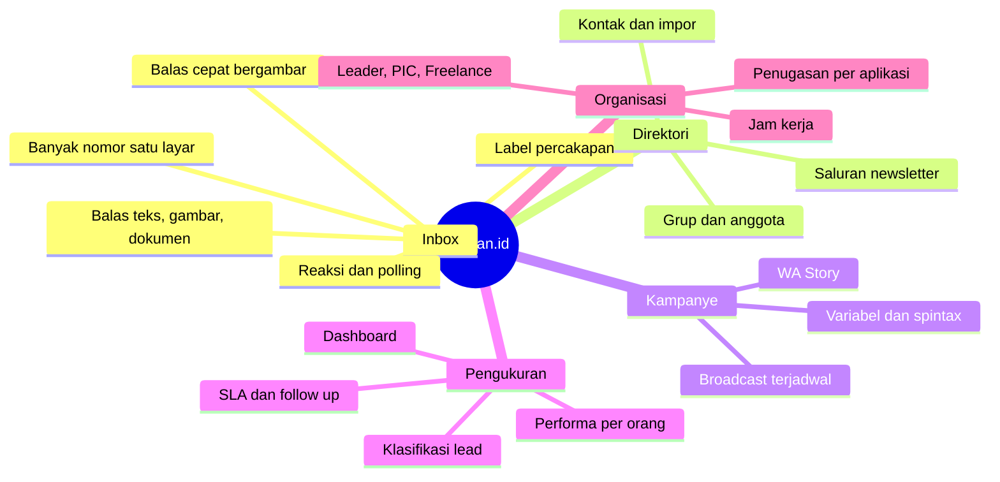

# 1. Product Brief

## 1.1 Nama produk

**salesan.id**

Nama domain produksi:

| Lingkungan | Alamat |
|---|---|
| Aplikasi web | `https://salesan.marseltech.cloud` |
| API dan Supabase | `https://api.salesan.marseltech.cloud` |

## 1.2 Latar belakang

`[DATA BELUM TERSEDIA]` — Latar belakang bisnis tidak tertulis di dalam kode
maupun basis data. Yang bisa dipastikan dari sistem yang berjalan hanyalah
kondisi operasional yang dilayani aplikasi ini:

| Fakta terukur | Nilai | Sumber |
|---|---|---|
| Nomor WhatsApp yang dikelola | 35 (31 tersambung) | tabel `whatsapp_accounts` |
| Produk/brand yang dilayani | 22 | tabel `applications` |
| Anggota tim operasional | 20 | tabel `users` |
| Kontak tersimpan | 396.823 | tabel `contacts` |
| Percakapan aktif | 98.600 | tabel `conversations` |

Pola ini, yaitu puluhan nomor WhatsApp dan puluhan brand dilayani satu tim,
adalah persoalan yang tidak bisa ditangani aplikasi WhatsApp bawaan. Itu
konteks teknis yang bisa dibaca dari data; motivasi bisnis di baliknya perlu
dilengkapi pemilik produk.

**Yang perlu dilengkapi:** kapan produk mulai dibangun, masalah operasional apa
yang memicunya, dan apakah ini produk internal atau dijual ke pihak lain.

## 1.3 Problem statement

Diturunkan dari kemampuan yang benar-benar dibangun, bukan dari klaim:

| Masalah yang dijawab sistem | Bukti di dalam sistem |
|---|---|
| Satu tim harus memegang banyak nomor WhatsApp sekaligus | 35 akun dalam satu inbox, tabel `whatsapp_accounts` |
| Pekerjaan tiap admin tidak terukur | Modul Performa, tabel `sla_cycles`, `follow_up_events` |
| Kecepatan balas tidak terpantau | SLA dengan target per aplikasi, tabel `sla_targets` |
| Jawaban berulang diketik manual | Balas cepat, 152 entri di tabel `quick_replies` |
| Promosi massal harus dikirim satu per satu | Broadcast dan WA Story, tabel `content_campaigns` |
| Nomor besar tidak bisa dipegang satu orang | Peran Leader/PIC/Freelance dengan pembatasan akses |

`[DATA BELUM TERSEDIA]` — Prioritas antar masalah di atas, dan mana yang paling
mahal jika tidak diselesaikan, adalah penilaian pemilik produk.

## 1.4 Solution

salesan.id adalah aplikasi web yang menyambungkan banyak nomor WhatsApp ke satu
tempat kerja, memakai protokol WhatsApp Web multi-device melalui pustaka
`whatsmeow`. Bukan WhatsApp Business API resmi.

Kemampuan yang sudah berjalan:

## 1.5 Target user

Diturunkan dari peran yang ada di sistem (`operational_role`):

| Peran | Jumlah aktif | Yang bisa dilihat |
|---|---|---|
| **Leader** | lihat tabel `role_assignments` | Seluruh workspace |
| **PIC** | lihat tabel `role_assignments` | Aplikasi yang ditugaskan + freelance di bawahnya |
| **Freelance** | lihat tabel `role_assignments` | Aplikasi yang ditugaskan, performa dirinya sendiri |

Selain itu ada peran tingkat workspace (`workspace_role`): `owner`, `admin`,
`agent`. Peran inilah yang menentukan kepemilikan workspace, sementara
`operational_role` menentukan pembagian kerja harian.

`[DATA BELUM TERSEDIA]` — Profil pengguna di luar peran teknis: latar belakang,
tingkat kemampuan komputer, dan perangkat yang dipakai sehari-hari.

## 1.6 Value proposition

Klaim di bawah ini hanya mencantumkan yang bisa dibuktikan dari sistem:

| Klaim | Bukti |
|---|---|
| Satu inbox untuk puluhan nomor | 35 akun aktif bersamaan dalam satu workspace |
| Pekerjaan tiap orang terukur | Performa per anggota, dibatasi peran |
| Kecepatan balas terpantau | SLA per aplikasi dengan jam kerja |
| Kirim massal tanpa satu per satu | Broadcast ke kontak, grup, atau nomor tempel |
| Riwayat tidak hilang saat server restart | Antrean kampanye tersimpan di basis data, bukan memori |

`[DATA BELUM TERSEDIA]` — Posisi terhadap produk pesaing dan alasan komersial
memilih salesan.id dibanding alternatif.

## 1.7 Objective

`[DATA BELUM TERSEDIA]` — Tujuan terukur seperti target jumlah pengguna,
pendapatan, atau tingkat adopsi tidak tercatat di sistem.

Tujuan teknis yang terbaca dari keputusan desain di dalam kode:

1. **Tidak memalsukan perilaku manusia.** Tidak ada simulasi mengetik atau
   membaca palsu untuk mengelabui deteksi WhatsApp. Jeda antar kiriman adalah
   pengaturan antrean yang dinyatakan apa adanya.
2. **Tidak mengarang data.** Angka penonton Story dinyatakan sebagai batas
   bawah, bukan jumlah penonton, karena whatsmeow tidak menyediakan daftar
   penonton. Hasil pengiriman yang tidak diketahui dicatat sebagai tidak
   diketahui, bukan ditebak.
3. **Kredensial WhatsApp tidak pernah mencapai peramban.** Sesi WhatsApp
   disimpan di basis data server; browser hanya menerima tautan bertanda tangan
   berbatas waktu untuk media.
4. **Setiap pembatasan ditegakkan di backend.** Pembatasan peran bukan sekadar
   menyembunyikan menu di tampilan.

---

## Ringkasan yang belum tersedia

| Butir | Siapa yang memegang jawabannya |
|---|---|
| Latar belakang dan pemicu produk | Pemilik produk |
| Prioritas antar masalah | Pemilik produk |
| Profil pengguna di luar peran | Pemilik produk / riset pengguna |
| Posisi terhadap pesaing | Pemilik produk |
| Tujuan komersial terukur | Pemilik produk |
