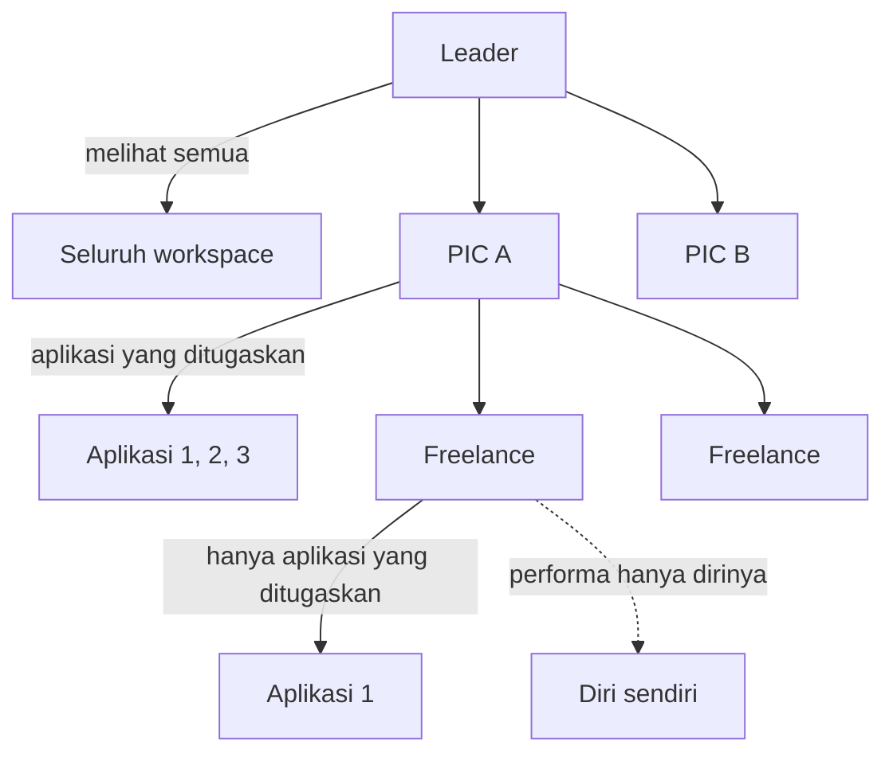

# 2. Product Requirement Document

Dokumen ini menulis ulang kebutuhan produk dari perilaku sistem yang sudah
berjalan. Setiap baris bisa ditelusuri ke kode atau basis data.

## 2.1 Feature overview

| Modul | Halaman | Status | Berjalan di produksi |
|---|---|---|---|
| Inbox / Chat | `/chat` | Berjalan | Ya, 97.979 pesan |
| Akun WhatsApp | `/accounts` | Berjalan | Ya, 35 akun |
| Kontak | `/contacts` | Berjalan | Ya, 396.823 kontak |
| Grup | `/groups` | Berjalan | Ya, direktori lintas nomor |
| Broadcast | `/broadcast` | Berjalan | Ya, 69 kampanye |
| WA Story | `/story` | Berjalan | Ya, 72 publikasi |
| Balas cepat | `/balas-cepat` | Berjalan | Ya, 152 entri |
| Dashboard | `/dashboard` | Berjalan | Ya |
| Performa | `/performa` | Berjalan | Ya |
| SLA | `/sla` | Berjalan | Ya, 5.434 siklus |
| Jam kerja | `/jam-kerja` | Berjalan | Tabel `work_schedules` masih kosong |
| Variabel | `/variabel` | Berjalan | Tabel `custom_variables` masih kosong |
| Pengaturan / Organisasi | `/pengaturan` | Berjalan | Ya, 20 anggota |
| Instagram, TikTok, Chatbot, Auto Follow Up | — | `COMING SOON` | Tidak |

## 2.2 Functional requirement

### FR-1 Akun WhatsApp

| Kode | Kebutuhan | Bukti |
|---|---|---|
| FR-1.1 | Sistem menyambungkan nomor WhatsApp melalui pemindaian kode QR | `POST /accounts/{id}/pair`, `GET /accounts/{id}/qr` |
| FR-1.2 | Sistem menyambung ulang otomatis saat koneksi putus | `RECONNECT_BASE_DELAY`, `RECONNECT_MAX_DELAY` |
| FR-1.3 | Sistem menarik kontak, grup, dan riwayat dari perangkat | `POST /accounts/{id}/sync` |
| FR-1.4 | Sistem menyimpan sesi WhatsApp di basis data, tidak pernah dikirim ke peramban | Skema `whatsmeow_*`, 17 tabel |
| FR-1.5 | Nomor bisa diputus dan dikeluarkan tanpa menghapus riwayatnya | `POST /disconnect`, `POST /logout` |

### FR-2 Inbox dan percakapan

| Kode | Kebutuhan | Bukti |
|---|---|---|
| FR-2.1 | Menampilkan percakapan satu nomor, diurutkan pesan terakhir | `GET /accounts/{id}/conversations` |
| FR-2.2 | Mengirim pesan teks dengan kutipan balasan | `POST /conversations/{id}/messages` |
| FR-2.3 | Mengirim media dengan kutipan balasan | `POST /conversations/{id}/media` |
| FR-2.4 | Foto diubah ke JPEG sebelum dikirim ke WhatsApp | `internal/wa/imagenormalise.go` |
| FR-2.5 | Mengubah dan menghapus pesan terkirim | `PATCH /messages/{id}`, `DELETE /messages/{id}` |
| FR-2.6 | Meneruskan pesan ke percakapan lain | `POST /messages/{id}/forward` |
| FR-2.7 | Membalas anggota grup lewat japri | `POST /messages/{id}/private-reply` |
| FR-2.8 | Memberi reaksi emoji | `POST /messages/{id}/react` |
| FR-2.9 | Membuat dan memilih polling | `POST /conversations/{id}/polls`, `POST /messages/{id}/vote` |
| FR-2.10 | Menandai percakapan sudah/belum dibaca | `POST /read`, `POST /unread` |
| FR-2.11 | Memberi label percakapan, tersinkron dengan label WhatsApp | `POST /conversations/{id}/labels` |
| FR-2.12 | Menampilkan siapa saja yang sedang membuka percakapan yang sama | Event realtime `presence.viewers` |

### FR-3 Broadcast

| Kode | Kebutuhan | Bukti |
|---|---|---|
| FR-3.1 | Memilih penerima dari kontak, anggota grup, grup, atau nomor tempel | `target_source`: `contacts`, `group_members`, `groups`, `manual`, `csv` |
| FR-3.2 | Pratinjau jumlah penerima sebelum disimpan | `POST /campaigns/preview` |
| FR-3.3 | Menolak kampanye tanpa penerima, dengan alasan | Galat `no_recipients` |
| FR-3.4 | Menolak komunitas dan grup khusus admin sebagai tujuan, dengan alasan | Kolom `group_is_community`, `group_announce` |
| FR-3.5 | Menjadwalkan pengiriman, termasuk berulang harian/mingguan/bulanan | Kolom `recurrence`, `recurrence_time` |
| FR-3.6 | Menyebar beban ke beberapa nomor pengirim | Tabel `broadcast_sender_devices` |
| FR-3.7 | Memberi jeda antar kiriman sesuai profil | `delay_profile`, `delay_min_seconds`, `delay_max_seconds` |
| FR-3.8 | Mencoba ulang pengiriman yang gagal, terbatas | `max_attempts`, `retry_gap_seconds` |
| FR-3.9 | Mengeluarkan chat tujuan dari arsip setelah terkirim | Kolom `surface_on_phone`, bawaan menyala |
| FR-3.10 | Melaporkan hasil per penerima, bisa diekspor | `GET /campaigns/{id}/targets/export` |

### FR-4 WA Story

| Kode | Kebutuhan | Bukti |
|---|---|---|
| FR-4.1 | Menerbitkan status ke beberapa nomor sekaligus | Tabel `story_publications` |
| FR-4.2 | Menerbitkan nomor secara paralel, dibatasi | `CAMPAIGN_STORY_CONCURRENCY`, bawaan 3 |
| FR-4.3 | Mencatat penonton dari tanda baca yang diterima | Tabel `story_views`, 34.307 baris |
| FR-4.4 | Menyatakan angka penonton sebagai batas bawah, bukan jumlah pasti | Keterangan di antarmuka dan di kode |
| FR-4.5 | Menutup Story lebih awal | `POST /campaigns/{id}/publications/{publicationID}/revoke` |
| FR-4.6 | Menutup Story otomatis setelah 24 jam | Sapuan `ExpireStories` tiap 10 menit |

### FR-5 Pengukuran kinerja

| Kode | Kebutuhan | Bukti |
|---|---|---|
| FR-5.1 | Mengukur kecepatan balas terhadap target per aplikasi | Tabel `sla_targets`, `sla_cycles` |
| FR-5.2 | Menghitung SLA hanya di dalam jam kerja jika diaktifkan | `SLA_BUSINESS_HOURS`, tabel `work_schedules` |
| FR-5.3 | Mencatat follow up, satu per percakapan per hari | Tabel `follow_up_events` |
| FR-5.4 | Mengklasifikasikan lead | Enum `lead_status`: `verified_new`, `historical`, `unknown` |
| FR-5.5 | Memisahkan pesan kampanye dari hitungan pelayanan pribadi | Enum `sender_source` memisahkan `broadcast` dan `web_admin` |
| FR-5.6 | Menyusun rekap per anggota tim | `GET /performance/members` |

### FR-6 Organisasi dan akses

| Kode | Kebutuhan | Bukti |
|---|---|---|
| FR-6.1 | Tiga peran operasional: Leader, PIC, Freelance | Enum `operational_role` |
| FR-6.2 | Menugaskan aplikasi ke PIC dan Freelance | Tabel `pic_application_assignments`, `freelancer_application_assignments` |
| FR-6.3 | Menugaskan Freelance ke PIC | Tabel `freelancer_pic_assignments` |
| FR-6.4 | Menonaktifkan anggota tanpa menghapus riwayatnya | `PATCH /org/members/{id}/active` |
| FR-6.5 | Satu aplikasi hanya punya satu PIC | Migration `0058_one_pic_per_application.sql` |

## 2.3 Non-functional requirement

| Kode | Kebutuhan | Nilai terukur di produksi |
|---|---|---|
| NFR-1 | Membuka inbox satu nomor harus cepat walau data besar | 0,26 ms untuk 98.600 percakapan |
| NFR-2 | Kueri tidak boleh memindai seluruh tabel lintas nomor | Indeks per `account_id` di tabel besar |
| NFR-3 | Pengiriman harus punya batas waktu | `CAMPAIGN_SEND_TIMEOUT` 2 menit, `CAMPAIGN_STORY_TIMEOUT` 45 menit |
| NFR-4 | Antrean harus selamat dari restart | Klaim dan lease di basis data, bukan memori |
| NFR-5 | Kredensial WhatsApp tidak boleh mencapai peramban | Sesi hanya di basis data server |
| NFR-6 | Media tidak boleh disimpan sebagai base64 di basis data | Disimpan di bucket privat, diakses lewat tautan bertanda tangan |
| NFR-7 | Tautan media harus kedaluwarsa | `MEDIA_URL_TTL` |
| NFR-8 | Pembatasan akses ditegakkan di backend | Middleware `requireAccountScope`, `requireConversationScope` |
| NFR-9 | Unduhan media dari URL harus aman dari SSRF | Paket `internal/mediafetch` menolak alamat privat |
| NFR-10 | Basis data tidak boleh kehabisan koneksi | 16 untuk aplikasi + 16 untuk whatsmeow, batas 100 |

`[DATA BELUM TERSEDIA]` — Target ketersediaan (uptime), batas waktu pemulihan
(RTO/RPO), dan jumlah pengguna serentak yang harus didukung belum ditetapkan.

## 2.4 User role dan permission

### Peran tingkat workspace

Enum `workspace_role`: `owner`, `admin`, `agent`. Menentukan kepemilikan
workspace. Pemilik workspace yang belum diberi peran operasional diperlakukan
sebagai Leader, supaya workspace baru tidak mengunci pemiliknya sendiri.

### Peran operasional

### Matriks izin

Dibaca langsung dari fungsi izin di `internal/httpapi/`.

| Kemampuan | Leader | PIC | Freelance | Penegak |
|---|---|---|---|---|
| Melihat seluruh workspace | Ya | Tidak | Tidak | `Scope.All` |
| Kelola aplikasi | Ya | Tidak | Tidak | `requireLeader` |
| Kelola anggota dan peran | Ya | Tidak | Tidak | `requireLeader` |
| Buka inbox nomor yang ditugaskan | Ya | Ya | Ya | `requireAccountScope` |
| Buat dan ubah balas cepat | Ya | Ya | Ya | `canManageQuickReplies` |
| Balas cepat lintas semua aplikasi | Ya | Tidak | Tidak | Migration 0059 |
| Buat kampanye | Ya | Ya | Ya | `canManageCampaign` |
| Ubah kampanye milik orang lain | Ya | Ya | Tidak | `canManageCampaign` |
| Ubah kampanye buatan sendiri | Ya | Ya | Ya | `canManageCampaign` |
| Tentukan label kampanye dan variabel | Ya | Ya | Tidak | `canDefineVocabulary` |
| Lihat performa orang lain | Ya | Sebatas timnya | Tidak | `Scope.CanSeeAdmin` |
| Lihat performa diri sendiri | Ya | Ya | Ya | `Scope.AdminIDs` selalu memuat diri sendiri |

> Freelance sengaja dikunci pada dirinya sendiri di modul Performa. Pembatasan
> ini berada di lapisan repositori, bukan di tampilan, sehingga memanggil API
> secara langsung tetap ditolak.

## 2.5 Business rule

| Kode | Aturan | Alasan yang tercatat di kode |
|---|---|---|
| BR-1 | Satu aplikasi hanya boleh punya satu PIC | Migration 0058 |
| BR-2 | Balas cepat "semua aplikasi" hanya milik Leader | Migration 0059 |
| BR-3 | Kampanye tanpa penerima ditolak saat dibuat | Kampanye kosong dulu gagal sedetik setelah mulai tanpa alasan terbaca |
| BR-4 | Komunitas bukan tujuan broadcast yang sah | WhatsApp menolaknya dengan error 420 |
| BR-5 | Grup khusus admin bukan tujuan yang sah jika nomor kita bukan admin | Sama, error 420 |
| BR-6 | Pengiriman yang lewat batas waktu dicatat "tidak diketahui", tidak diulang | Percobaan ulang mencetak id pesan baru, berisiko kirim dua kali |
| BR-7 | Story yang lewat batas waktu boleh diulang | Percobaan ulang memakai id pesan yang sama, WhatsApp membuang duplikat |
| BR-8 | Pesan kampanye tidak dihitung sebagai pelayanan pribadi | Memisahkan `sender_source` `broadcast` dari `web_admin` |
| BR-9 | Angka penonton Story adalah batas bawah | whatsmeow tidak menyediakan daftar penonton |
| BR-10 | Riwayat pengiriman dan performa tidak dihapus permanen | Hanya WA Story yang dikecualikan |
| BR-11 | Kampanye yang semua nomornya putus akan gagal setelah tenggang | `CAMPAIGN_OFFLINE_GRACE`, bawaan 30 menit |
| BR-12 | Satu orang adalah satu baris kontak per nomor | Fungsi `merge_contact_rows`, migration 0062 |

## 2.6 User scenario

### S-1 Admin membalas pelanggan

1. Admin masuk, memilih aplikasi, lalu memilih nomor.
2. Inbox menampilkan percakapan dengan yang belum dibalas di atas.
3. Admin membuka percakapan; sistem menampilkan siapa lagi yang sedang membukanya.
4. Admin membalas, bisa mengutip pesan pelanggan.
5. Siklus SLA ditutup, dan waktu balasnya dicatat.

### S-2 PIC mengirim broadcast promosi

1. PIC membuka Broadcast, menekan buat baru.
2. Memilih nomor pengirim dan sumber penerima.
3. Sistem menampilkan pratinjau: jumlah valid, duplikat, dan masalah per tujuan.
4. PIC menulis pesan, boleh memakai variabel dan spintax.
5. PIC menjadwalkan atau menjalankan sekarang.
6. Worker mengirim bertahap; laporan terisi per penerima.

### S-3 Leader memeriksa kinerja tim

1. Leader membuka Performa, memilih periode.
2. Melihat rekap per anggota: pesan keluar, kontak dilayani, SLA, follow up.
3. Menelusuri satu angka sampai ke daftar percakapan penyusunnya.

### S-4 Freelance memakai balas cepat

1. Freelance membuka percakapan dan memilih pesan pelanggan untuk dibalas.
2. Mengetik garis miring, memilih balas cepat bergambar.
3. Menyesuaikan teksnya, lalu mengirim.
4. Gambar terkirim dengan kutipan pesan pelanggan.

`[DATA BELUM TERSEDIA]` — Skenario kegagalan dari sudut pandang pengguna,
misalnya apa yang diharapkan terjadi saat nomor keluar sendiri di tengah jam
sibuk, belum ditetapkan sebagai kebutuhan produk.

---

## Ringkasan yang belum tersedia

| Butir | Siapa yang memegang jawabannya |
|---|---|
| Target uptime, RTO, RPO | Pemilik produk / operasional |
| Jumlah pengguna serentak yang harus didukung | Pemilik produk |
| Skenario kegagalan dari sudut pengguna | Product manager |
| Prioritas fitur `COMING SOON` | Pemilik produk |
