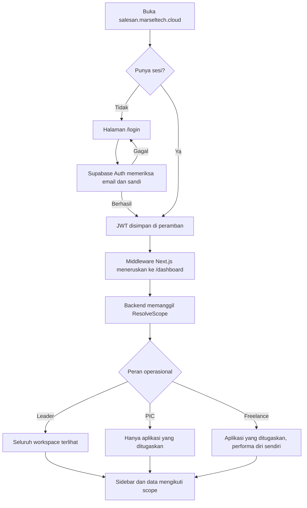
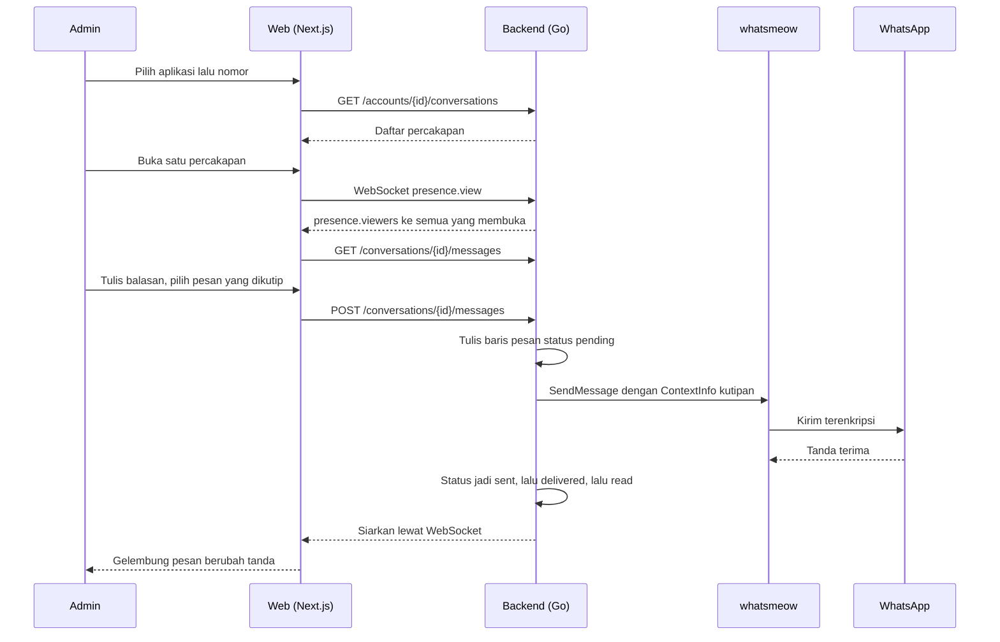
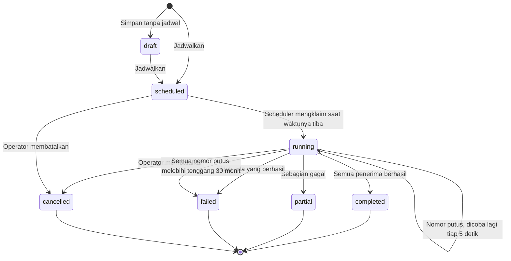
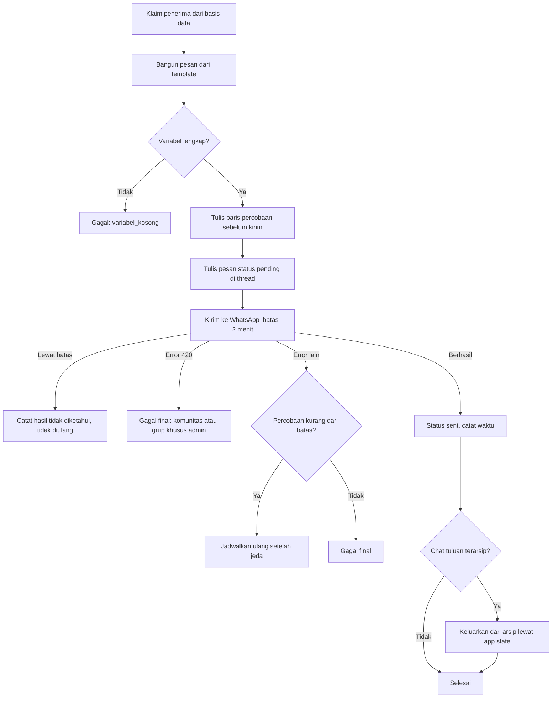
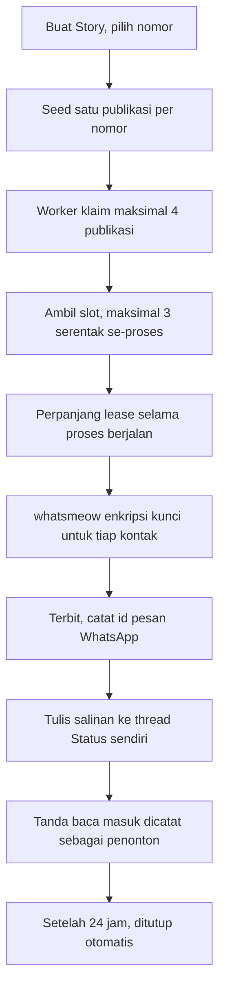
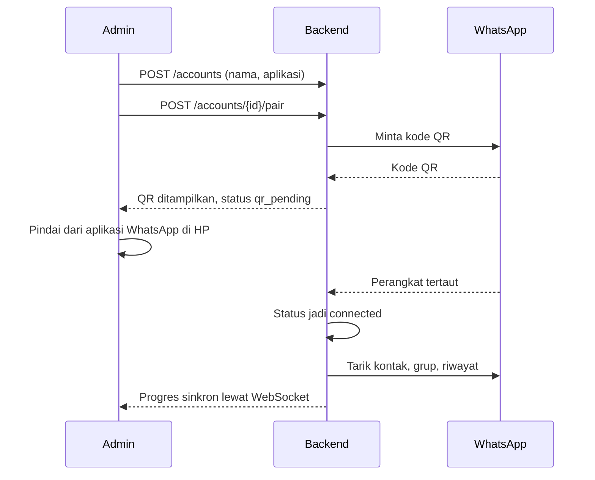
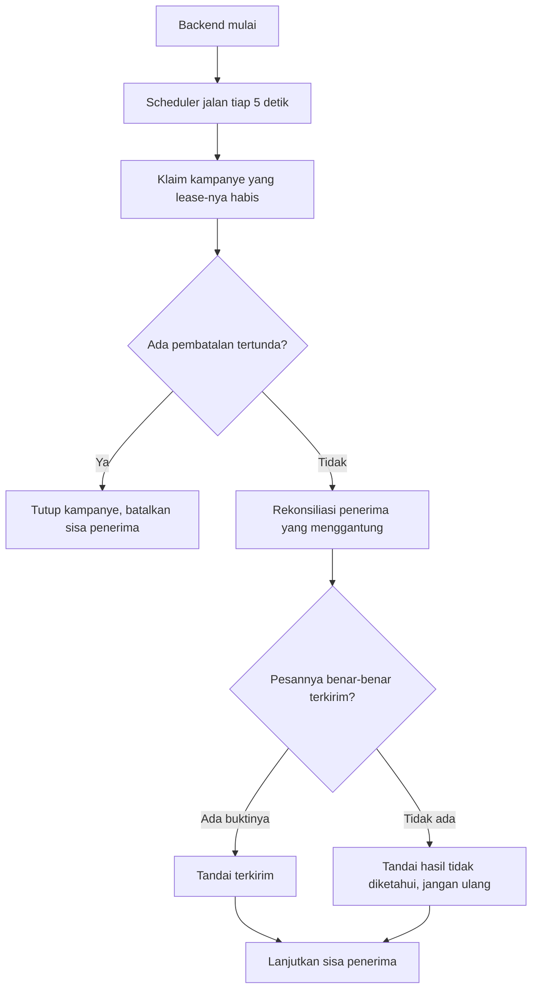

# 3. User Flow Documentation

Alur di dokumen ini diturunkan dari rute aplikasi, middleware, dan perilaku
worker yang benar-benar berjalan.

## 3.1 Main user journey

### Masuk sampai bisa bekerja

Scope dihitung ulang di backend pada setiap permintaan. Tidak ada peran yang
disimpan di peramban dan dipercaya begitu saja.

### Membalas pelanggan

## 3.2 Feature flow

### Broadcast dari pembuatan sampai laporan

Langkah worker untuk satu penerima:

### WA Story

> Satu Story bukan satu kiriman. WhatsApp mengalamatkannya ke seluruh kontak
> tersimpan nomor itu, sehingga nomor dengan puluhan ribu kontak butuh waktu
> nyata. Detail pengukurannya ada di [`docs/broadcast-dan-story.md`](../broadcast-dan-story.md).

### Menyambungkan nomor baru

## 3.3 Exception flow

| Kejadian | Yang dilakukan sistem | Yang dilihat operator |
|---|---|---|
| Nomor keluar dari WhatsApp | Status jadi `logged_out`, pengiriman dari nomor itu gagal | Nomor ditandai perlu pindai ulang |
| Semua nomor kampanye putus | Menunggu, dicoba tiap 5 detik, gagal setelah 30 menit | Kampanye gagal dengan nama nomor yang hilang |
| Pengiriman menggantung | Dibatalkan setelah 2 menit, dicatat tidak diketahui | "Hasil pengiriman tidak diketahui, periksa percakapan" |
| Backend restart saat kampanye jalan | Lease habis, kampanye diklaim ulang, yang menggantung direkonsiliasi | Kampanye lanjut sendiri |
| Pembatalan saat worker sedang mengirim | Penanda dipasang, worker menutup kampanye di kesempatan berikutnya | Kampanye jadi dibatalkan, sisa penerima ditandai dibatalkan |
| Kampanye selesai meninggalkan penerima menggantung | Sapuan tiap 10 menit menutupnya | Laporan tidak lagi menyisakan "sedang diproses" |
| Gambar bukan JPEG | Diubah ke JPEG sebelum diunggah | Tidak terlihat, gambar sampai seperti biasa |
| Gambar tidak bisa dibaca | Dikirim apa adanya | Tidak terlihat |
| Media di URL gagal diambil | Kampanye ditolak sebelum tersimpan | "Media tidak dapat diambil" beserta sebabnya |
| Grup tujuan ternyata komunitas | Ditolak di pratinjau | "Ini komunitas, bukan grup chat" |
| Dua alamat untuk satu orang | Baris kontak digabung | Kontak tidak lagi dobel |

### Pemulihan setelah restart

## 3.4 Customer journey map

`[DATA BELUM TERSEDIA]` — Peta perjalanan pelanggan akhir, yaitu orang yang
menerima pesan WhatsApp, tidak bisa diturunkan dari sistem ini. Sistem hanya
merekam sisi operator. Untuk menyusunnya diperlukan riset terhadap penerima.

Yang tersedia dari sistem adalah jejak yang bisa diukur pada sisi pelanggan:

| Tahap | Yang tercatat | Tabel |
|---|---|---|
| Pertama kali dikenal | Waktu pertama terlihat, dari mana | `contact_first_seen` |
| Masuk percakapan | Pesan pertama masuk, waktu balas pertama | `sla_cycles` |
| Diberi label | Perubahan label beserta pelakunya | `contact_label_events` |
| Dinilai sebagai lead | `verified_new`, `historical`, `unknown` | `lead_classifications` |
| Ditindaklanjuti | Satu catatan per percakapan per hari | `follow_up_events` |
| Menerima kampanye | Status per penerima | `campaign_targets` |

Enam tabel itu cukup untuk menyusun peta perjalanan pelanggan berbasis data,
tetapi penafsirannya menjadi tahapan bisnis belum ditetapkan.

---

## Ringkasan yang belum tersedia

| Butir | Siapa yang memegang jawabannya |
|---|---|
| Customer journey map sisi penerima | Product manager / riset pengguna |
| Tahapan bisnis dari data lead | Pemilik produk |
| Harapan operator saat nomor keluar mendadak | Operasional |
