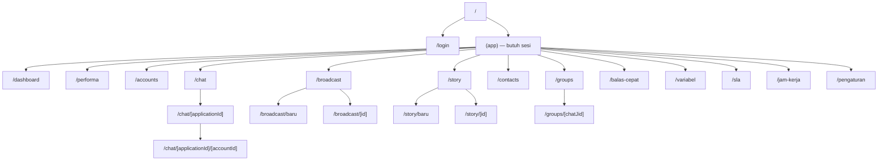

# 4. UI/UX Documentation

Bagian arahan desain di dokumen ini merujuk [`DESIGN.md`](../../DESIGN.md) yang
ditulis pemilik produk. Sisanya dibaca dari `web/src/`.

## 4.1 Sitemap

Total 22 rute halaman, satu di antaranya publik (`/login`).

## 4.2 Navigation structure

Sidebar dikelompokkan dan memuat menu yang belum dibangun sebagai `COMING SOON`,
disengaja agar tata letak sesuai referensi rancangan.

| Kelompok | Menu | Status |
|---|---|---|
| Ikhtisar | Dashboard, Performa | Aktif |
| Akun | Akun WhatsApp | Aktif |
| Akun | Akun Instagram, Akun TikTok | `COMING SOON` |
| Percakapan | Chat WhatsApp | Aktif |
| Percakapan | Chat Instagram, Chat TikTok | `COMING SOON` |
| Kampanye | Broadcast, WA Story | Aktif |
| Direktori | Kontak, Fetch Grup | Aktif |
| Otomatisasi | Chatbot, Auto Follow Up | `COMING SOON` |
| Pengaturan | Akun & Peran, Variabel Pesan, Balas Cepat, Target SLA, Jam Kerja | Aktif |

Menu yang muncul menyesuaikan peran. Kartu profil di bawah sidebar menampilkan
peran operasional dan surel pengguna, dibaca dari `GET /me`.

## 4.3 Screen list

| Halaman | Isi utama | Komponen kunci |
|---|---|---|
| `/login` | Masuk dengan surel dan sandi | — |
| `/dashboard` | Ringkasan periode, perbandingan periode sebelumnya, pemakaian label | `MetricCardGroup`, `TrafficChart`, `ChatMixDonut` |
| `/performa` | Rekap per anggota, peringkat tim, rincian harian | `PerformanceSummary`, `MemberBreakdownTable`, `TeamRank` |
| `/accounts` | Daftar nomor, status koneksi, pemindaian QR | `accounts/*` |
| `/chat/[app]/[acc]` | Inbox tiga kolom: daftar, percakapan, panel samping | `ConversationList`, `MessageThread`, `ChannelPanel` |
| `/broadcast` | Daftar kampanye dengan penyaring | `CampaignPage` |
| `/broadcast/baru` | Penyusun bertahap | `SenderStep`, `RecipientStep`, `MessageStep`, `DeliveryStep` |
| `/broadcast/[id]` | Laporan per penerima | `CampaignDetailPage` |
| `/story` | Kisi Story beserta status | `StoryGrid` |
| `/story/baru` | Penyusun Story | `StoryComposerPage`, `StoryPreview` |
| `/story/[id]` | Rincian per nomor dan penonton | `StoryDetailPage` |
| `/contacts` | Tabel kontak, impor, ekspor | `contacts/*` |
| `/groups` | Direktori grup lintas nomor | `GroupPanel` |
| `/balas-cepat` | Kelola balas cepat | — |
| `/pengaturan` | Anggota, peran, penugasan | `settings/*` |
| `/sla` | Target SLA per aplikasi | — |
| `/jam-kerja` | Jadwal kerja | — |
| `/variabel` | Variabel pesan kustom | — |

## 4.4 Component list

110 berkas TypeScript/TSX, 38.212 baris. Dikelompokkan sebagai berikut.

| Folder | Jumlah | Isi |
|---|---|---|
| `components/ui` | 7 | `Button`, `Modal`, `ConfirmDialog`, `AppLogo`, `BrandLogo`, `Primitives`, `control` |
| `components/chat` | 20 | Lihat tabel di bawah |
| `components/analytics` | 23 | Kartu metrik, grafik, tabel, panel telusur |
| `components/campaign` | 13 | Penyusun bertahap, pratinjau, laporan |
| `components/accounts` | 4 | Kartu nomor, pemindaian QR |
| `components/contacts` | 2 | Tabel dan impor |
| `components/layout` | 2 | `Sidebar`, `AppShell` |
| `components/settings` | 1 | Pengelolaan anggota |

Komponen chat, karena paling padat:

| Komponen | Tugas |
|---|---|
| `ConversationList` | Daftar percakapan, penanda siapa sedang membuka |
| `MessageThread` | Gelembung pesan, penyusun balasan, kutipan |
| `MessageBubble` | Satu pesan beserta status dan kutipannya |
| `MessageMenu` | Ubah, hapus, teruskan, balas japri, reaksi |
| `MediaComposer`, `MediaAttachment`, `MediaViewer` | Kirim dan lihat media |
| `ImageEditor` | Sunting gambar sebelum dikirim |
| `QuickReplyMenu` | Pemanggil balas cepat lewat garis miring |
| `PollComposer`, `PollBubble` | Buat dan tampilkan polling |
| `StatusPanel` | Daftar Status, termasuk Status Saya |
| `GroupPanel` | Anggota grup dan pengelolaannya |
| `ForwardDialog`, `PrivateReplyDialog` | Teruskan pesan, balas japri |
| `EmojiPicker`, `Reactions` | Reaksi emoji |
| `MentionText` | Penyorotan sebutan di grup |
| `AttachmentMenu` | Pemilih jenis lampiran |
| `ChannelPanel` | Panel samping kanal |

## 4.5 Design system

Sumber: [`DESIGN.md`](../../DESIGN.md), ditulis pemilik produk.

| Aspek | Keputusan | Alasan yang tercatat |
|---|---|---|
| Dasar | Minimalism dengan sentuhan Material Design | Layar padat data dan dibuka berjam-jam; minimalism menjaga fokus, elevasi tipis membedakan lapisan aktif |
| Tata letak | Bento grid | Ringkasan tiap kanal berdiri terpisah tetapi tetap satu pandangan. Ukuran kotak mengikuti bobot isi, bukan mengisi ruang |
| Framework | Tailwind CSS v4 | `web/package.json` |

Sisa isi `DESIGN.md` memuat keputusan warna, tipografi, dan komponen. Dokumen
itu adalah sumber kebenaran arahan desain dan tidak disalin ulang di sini agar
tidak ada dua versi yang bisa berselisih.

`[DATA BELUM TERSEDIA]` — Token desain yang terdokumentasi formal (daftar warna
beserta nama dan nilainya, skala jarak, skala tipografi) belum dipisahkan
sebagai berkas tersendiri. Saat ini nilainya tersebar di kelas Tailwind pada
masing-masing komponen.

## 4.6 UX explanation

Keputusan pengalaman pengguna yang bisa dibaca dari kode:

| Keputusan | Wujudnya | Alasan |
|---|---|---|
| Data lama tetap tampil saat menyegarkan | `keepPreviousData` pada SWR | Angka tidak berkedip kosong saat periode diganti |
| Penyegaran berbeda per layar | Inbox 30 detik, dashboard 60 detik, performa 300 detik | Inbox berubah tiap menit, laporan tidak |
| Realtime memicu penyegaran, bukan menggantinya | WebSocket memanggil `mutate` | Satu sumber kebenaran tetap di server |
| Penyegaran Status dibatasi | Paling cepat 3 detik sekali | `message.new` menyala untuk tiap pesan chat; tanpa batas, daftar Status disegarkan puluhan kali per menit tanpa perlu |
| Penanda siapa sedang membuka | Ikon mata di daftar dan judul percakapan | Mencegah dua admin membalas orang yang sama |
| Angka penonton Story diberi keterangan | "Dihitung dari receipt yang sampai ke sistem" | Angka itu batas bawah, bukan jumlah penonton |
| Pratinjau penerima sebelum menyimpan | Langkah tersendiri di penyusun | Kampanye tanpa penerima dulu gagal tanpa alasan terbaca |
| Masalah per tujuan disebutkan satu per satu | Daftar `problems` di pratinjau | "Tidak terjangkau" saja membuat operator menebak |

`[DATA BELUM TERSEDIA]` — Hasil pengujian kegunaan terhadap pengguna nyata,
dan alasan di balik tata letak tiga kolom pada inbox, belum terdokumentasi.

---

## Ringkasan yang belum tersedia

| Butir | Siapa yang memegang jawabannya |
|---|---|
| Token desain formal | Pemilik produk / desainer |
| Hasil uji kegunaan | Product manager |
| Panduan aksesibilitas | Desainer |
| Rancangan tampilan untuk menu `COMING SOON` | Pemilik produk |
