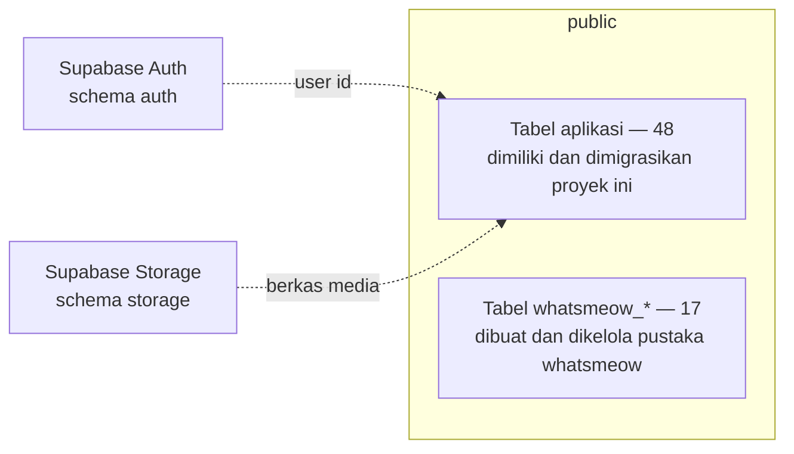
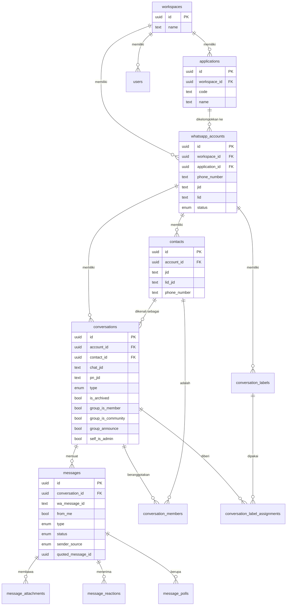
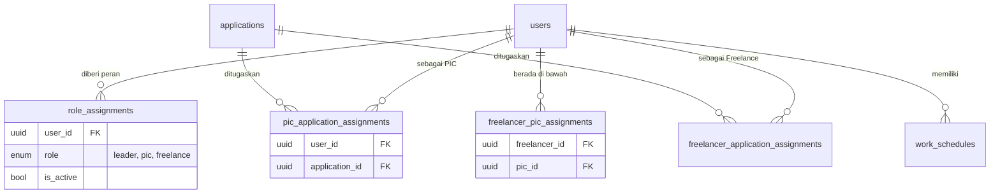
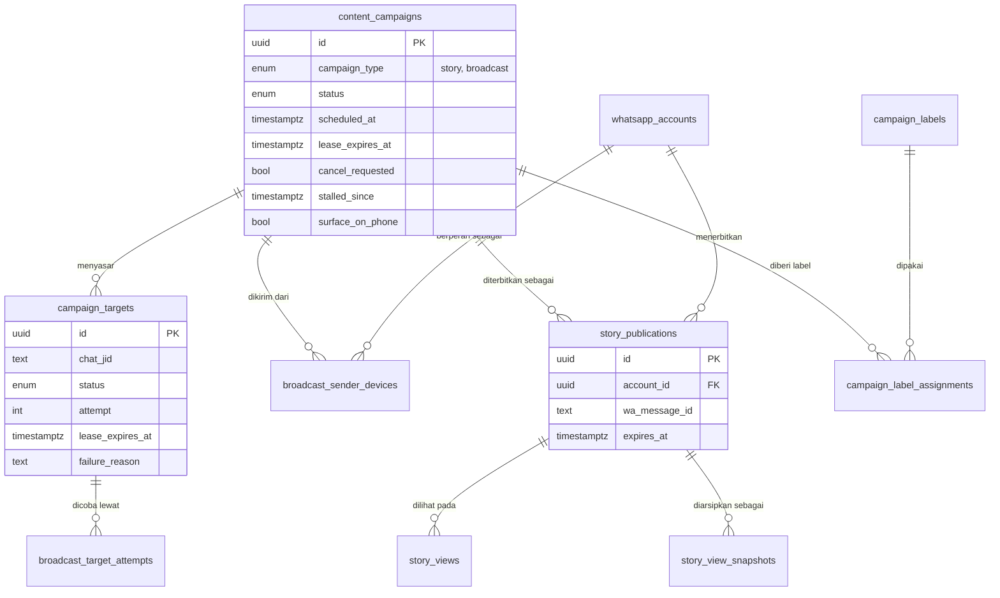
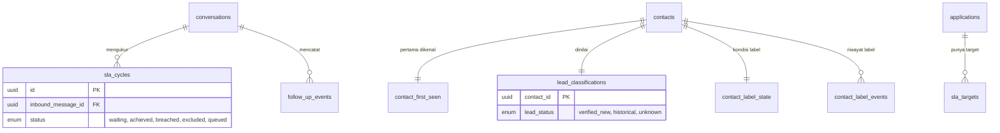
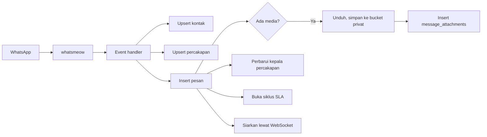
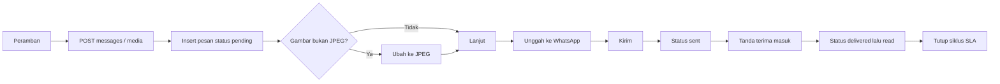
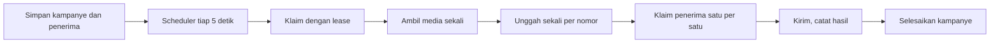

# 5. Database Documentation

Dibaca dari basis data produksi pada 23 September 2026 dan dari 67 berkas
migration di `backend/migrations/`.

## 5.1 Database architecture

| Aspek | Nilai |
|---|---|
| Mesin | PostgreSQL, dijalankan sebagai bagian Supabase self-hosted |
| Lokasi | VPS yang sama dengan aplikasi, kontainer `supabase-db` |
| Schema | `public` (aplikasi dan whatsmeow), `auth` dan `storage` (Supabase) |
| `max_connections` | 100 |
| Jatah koneksi backend | 16 untuk aplikasi, 16 untuk whatsmeow |
| Jumlah tabel aplikasi | 48 |
| Jumlah tabel whatsmeow | 17 |
| Migrasi | Bernomor urut, dijalankan `cmd/migrate`, dicatat di `schema_migrations` |

Dua kelompok tabel hidup berdampingan di schema yang sama:

Tabel `whatsmeow_*` **bukan milik proyek ini**. Pustaka whatsmeow membuat dan
memutakhirkannya sendiri saat perangkat pertama tersambung. Migrasi proyek
hanya boleh menambahkan indeks di atasnya, tidak mengubah strukturnya. Migration
`0064` melakukan tepat itu, dan keberadaan tabelnya diperiksa dulu karena pada
basis data baru tabel-tabel itu belum ada.

## 5.2 ERD

### Inti: workspace, aplikasi, nomor, percakapan

### Organisasi dan peran

### Kampanye

### Pengukuran kinerja

## 5.3 Table explanation

### Tabel terbesar di produksi

| Tabel | Baris | Peran |
|---|---|---|
| `conversation_members` | 499.013 | Anggota tiap grup, per percakapan |
| `contacts` | 396.823 | Kontak per nomor pengirim |
| `conversations` | 98.600 | Percakapan pribadi, grup, dan Status |
| `messages` | 97.979 | Seluruh pesan masuk dan keluar |
| `whatsapp_receipt_events` | 260.397 | Penjaga agar satu tanda terima tidak diproses dua kali |
| `whatsapp_label_events` | 52.850 | Riwayat label dari WhatsApp |
| `whatsapp_media_refs` | 40.429 | Rujukan media untuk mengunduh ulang |
| `message_attachments` | 39.807 | Lampiran, isinya tidak pernah disimpan di basis data |
| `story_views` | 34.307 | Tanda baca Status yang teramati |
| `contact_label_events` | 17.273 | Riwayat label kontak |
| `conversation_label_assignments` | 14.968 | Label yang menempel di percakapan |

### Penjelasan tabel inti

| Tabel | Penjelasan |
|---|---|
| `workspaces` | Batas terluar semua data. Setiap tabel besar membawa `workspace_id`. |
| `applications` | Brand atau produk. Nomor WhatsApp dikelompokkan ke sini, dan penugasan peran memakai aplikasi sebagai satuan. |
| `whatsapp_accounts` | Satu nomor WhatsApp. Menyimpan `jid` dan `lid`, dua alamat yang dipakai WhatsApp untuk satu nomor. |
| `conversations` | Satu utas. `chat_jid` adalah alamat yang dipakai WhatsApp pertama kali; `pn_jid` menyimpan bentuk nomor telepon bila utasnya lahir dari LID. Tanpa kolom kedua ini, satu orang bisa muncul dua kali di inbox. |
| `contacts` | Kontak per nomor pengirim, bukan per workspace. Buku alamat tiap perangkat berbeda. `lid_jid` menyimpan alamat kedua orang yang sama. |
| `messages` | Pesan. `sender_source` memisahkan asal: `web_admin`, `whatsapp_device`, `broadcast`, `story`, `bot`, `system`. Pemisahan inilah yang menjaga lalu lintas kampanye tidak terhitung sebagai pelayanan pribadi. |
| `message_attachments` | Metadata lampiran. Isinya disimpan di bucket privat, bukan di kolom. |
| `content_campaigns` | Induk Broadcast dan WA Story. Satu tabel untuk keduanya karena keduanya persoalan yang sama: menjadi siap, diklaim, dikerjakan bertahap, lalu dilaporkan. |
| `campaign_targets` | Satu baris per penerima Broadcast, beserta status dan alasan gagalnya. |
| `story_publications` | Satu baris per nomor yang menerbitkan Story. |
| `sla_cycles` | Satu siklus dari pesan masuk sampai dibalas. Unik terhadap `inbound_message_id`. |
| `whatsapp_receipt_events` | Idempotensi. Kuncinya kini berupa sidik tetap; sebelumnya gabungan seluruh id pesan dan bisa melampaui batas indeks. |

## 5.4 Relationship antar tabel

Aturan yang berlaku menyeluruh:

| Aturan | Wujudnya |
|---|---|
| Semua data terikat workspace | Kolom `workspace_id` pada tabel besar |
| Percakapan dan kontak terikat nomor, bukan workspace | `account_id` pada `conversations` dan `contacts` |
| Menghapus nomor menghapus turunannya | `on delete cascade` dari `whatsapp_accounts` |
| Satu orang satu baris kontak per nomor | Indeks unik `uq_contacts_account_phone` dan `uq_contacts_account_jid` |
| Satu percakapan per alamat per nomor | `uq_conversations_account_chat`, `uq_conversations_pn` |
| Satu pesan per id WhatsApp per nomor | `uq_messages_account_wamid` |
| Satu penerima per alamat per kampanye | `uq_campaign_targets` |

> **Catatan operasional untuk auditor:** menghapus satu `whatsapp_accounts`
> memicu rangkaian cascade yang panjang. Pada data produksi, satu penghapusan
> berjalan sekitar 90 detik dan membuat basis data sibuk penuh. Selama itu
> sebagian pesan masuk gagal disimpan karena kehabisan waktu tunggu.

## 5.5 Data flow

### Pesan masuk

### Pesan keluar

### Kampanye

## 5.6 Indeks penting

Ditambahkan setelah pengukuran, bukan diperkirakan.

| Indeks | Tabel | Untuk apa | Dampak terukur |
|---|---|---|---|
| `idx_whatsmeow_sessions_prefix` | `whatsmeow_sessions` | Pencocokan awalan saat perangkat berpindah alamat | 14,2 ms menjadi 0,16 ms; 71.062 blok menjadi 3 |
| `idx_whatsmeow_identity_keys_prefix` | `whatsmeow_identity_keys` | Sama | Ikut turun |
| `idx_messages_account_count` | `messages` | Hitungan pesan per nomor di daftar akun | Bagian dari 48.193 blok menjadi 1.106 |
| `idx_conversations_account_active` | `conversations` | Hitungan percakapan aktif per nomor | Sama |
| `idx_conversations_recency` | `conversations` | Sapuan rekonsiliasi metrik | Berhenti memindai 98.162 baris tiap 15 menit |
| `idx_conversations_account_contact` | `conversations` | Pemilih penerima broadcast | Pemindaian penuh hilang |
| `idx_conversations_inbox` | `conversations` | Membuka inbox satu nomor | 0,26 ms |

---

## Ringkasan yang belum tersedia

| Butir | Siapa yang memegang jawabannya |
|---|---|
| Kebijakan penyimpanan data lama | Pemilik produk / hukum |
| Rencana pemisahan data per pelanggan | Arsitek |
| Kebijakan anonimisasi kontak | Hukum |
