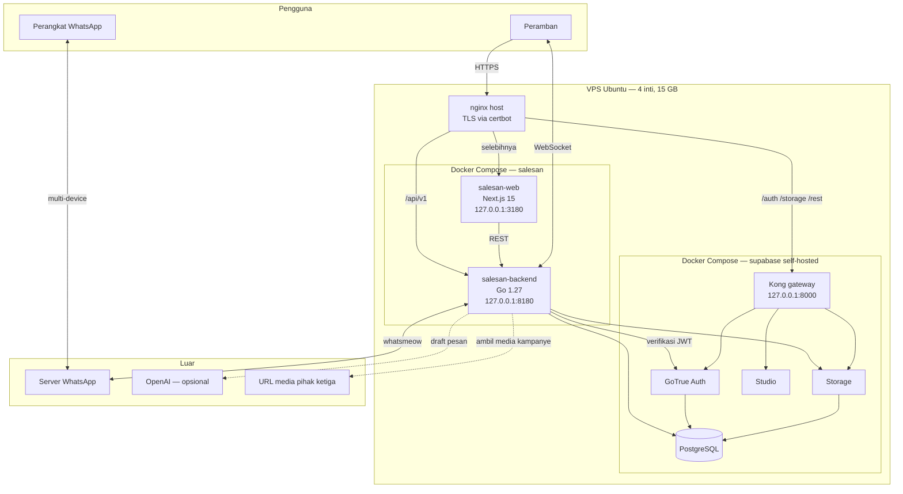
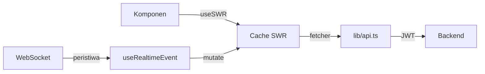
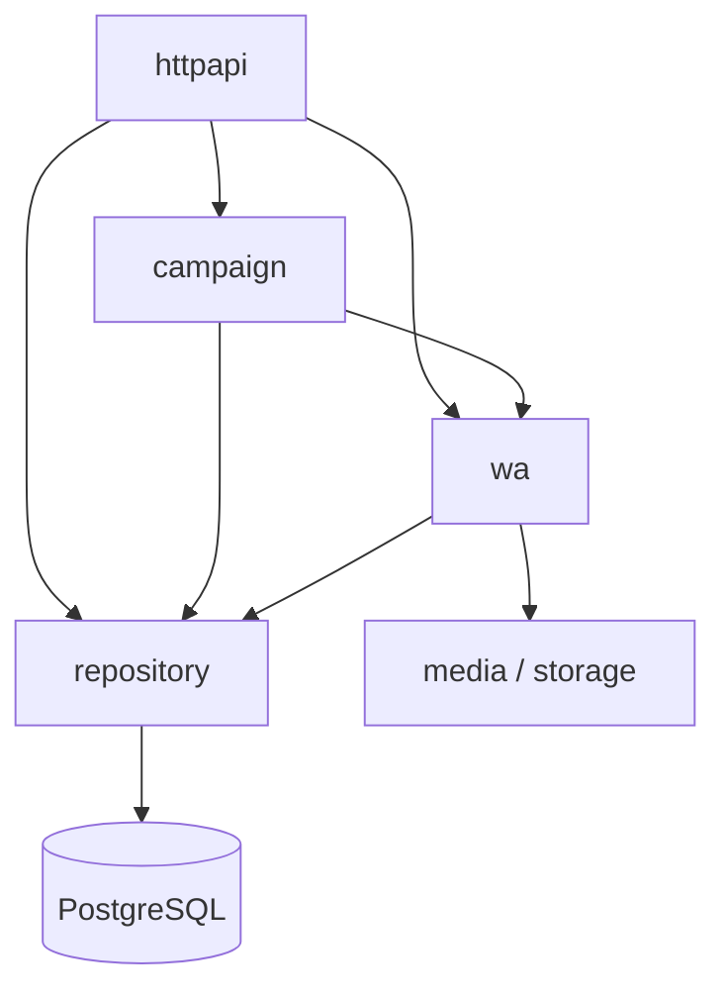
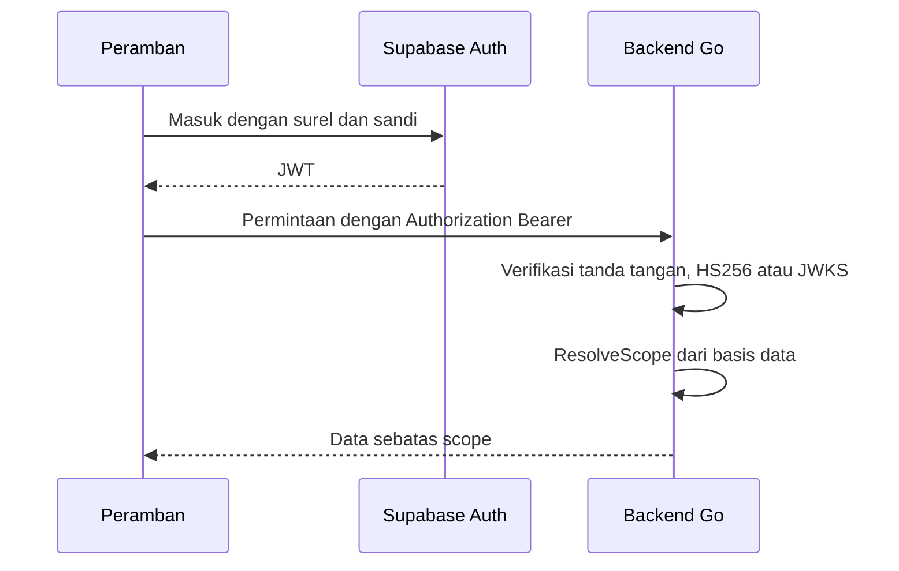

# 6. Technical Architecture

## 6.1 Gambaran menyeluruh

## 6.2 Frontend architecture

| Aspek | Pilihan |
|---|---|
| Framework | Next.js 15 (App Router) |
| Bahasa | TypeScript 5.9 |
| UI | React 19.1, Tailwind CSS v4 |
| Pengambilan data | SWR 2.3 |
| Autentikasi | Supabase Auth di peramban, JWT dikirim ke backend |
| Realtime | WebSocket ke backend Go |
| Ukuran | 110 berkas, 38.212 baris |

Pola yang dipakai:

- **Route group `(app)`** memisahkan halaman yang butuh sesi dari `/login`.
  `middleware.ts` menjaga batas itu.
- **SWR sebagai satu-satunya cache.** Tidak ada penyimpan status global lain.
  Peristiwa WebSocket tidak menulis data, hanya memanggil `mutate` sehingga
  server tetap satu-satunya sumber kebenaran.
- **Interval penyegaran berbeda per layar**, mengikuti seberapa sering datanya
  benar-benar berubah.

## 6.3 Backend architecture

| Aspek | Pilihan |
|---|---|
| Bahasa | Go 1.27 |
| Router | chi v5 |
| Basis data | pgx v5, kumpulan koneksi 16 |
| WhatsApp | whatsmeow, kumpulan koneksi terpisah 16 |
| WebSocket | gorilla/websocket |
| JWT | golang-jwt v5, HS256 dan JWKS |
| Ukuran | 126 berkas, 45.179 baris, ditambah 34 berkas uji |

### Paket

| Paket | Tanggung jawab |
|---|---|
| `httpapi` | Rute, middleware, penegakan izin, bentuk permintaan dan tanggapan |
| `repository` | Seluruh akses basis data. Tidak ada SQL di luar paket ini |
| `wa` | Sesi whatsmeow, pengiriman, penanganan peristiwa WhatsApp |
| `campaign` | Penjadwal dan worker Broadcast serta WA Story |
| `realtime` | Hub WebSocket, siaran peristiwa, kehadiran |
| `analytics` | Perhitungan metrik kinerja |
| `media` | Klasifikasi berkas, aturan jenis yang diizinkan |
| `mediafetch` | Unduhan media dari URL dengan penjagaan SSRF |
| `storage` | Bucket Supabase dan cadangan ke cakram lokal |
| `auth` | Verifikasi JWT |
| `models` | Bentuk data yang dipakai bersama |
| `config` | Pemuatan konfigurasi dari environment |
| `db` | Kumpulan koneksi |
| `compose` | Penyusunan pesan: variabel dan spintax |

Aturan lapisan yang dipegang konsisten:

`repository` tidak pernah memanggil `wa` atau `httpapi`. Seluruh SQL berada di
`repository`, sehingga perubahan skema punya satu tempat untuk diperiksa.

### Proses latar

| Proses | Jadwal | Tugas |
|---|---|---|
| `scheduleLoop` | Tiap `CAMPAIGN_POLL_INTERVAL`, bawaan 5 detik | Klaim kampanye yang waktunya tiba |
| `expiryLoop` | Tiap 10 menit | Tutup Story lewat 24 jam, tutup penerima yang ditinggalkan kampanye selesai |
| Rekonsiliasi metrik | Tiap `METRICS_RECONCILE_INTERVAL`, bawaan 15 menit | Perbaiki angka turunan yang tertinggal |
| Sambung ulang WhatsApp | Backoff `RECONNECT_BASE_DELAY` sampai `RECONNECT_MAX_DELAY` | Jaga nomor tetap tersambung |

### Prinsip antrean

Antrean tidak pernah berada di memori. Basis data yang membagikan klaim lewat
`for update skip locked`, dan lease berakhir sendiri bila proses mati. Itulah
yang membuat "backend restart di tengah kampanye" menjadi peristiwa biasa, bukan
insiden: tik berikutnya mengambil kampanye dari tempat ia berhenti.

## 6.4 Infrastructure

| Komponen | Keterangan |
|---|---|
| Server | VPS Ubuntu, 4 inti, 15 GB, `187.53.133.30` |
| Reverse proxy | nginx milik host, memegang port 80 dan 443 |
| TLS | certbot |
| Kontainer aplikasi | `salesan-backend`, `salesan-web` |
| Supabase | 11 kontainer, self-hosted di mesin yang sama |
| Jaringan | Kontainer aplikasi bergabung ke jaringan `supabase_default` |
| Kode | Klon git di `/opt/salesan/app` |
| Cadangan | Cron harian 02:30, disimpan 14 hari |

Pemetaan nginx:

| Pola | Tujuan |
|---|---|
| `= /health` | backend 8180 |
| `/api/v1/ws` | backend 8180, upgrade WebSocket |
| `^~ /api/v1/projects/` | gateway 8000, Studio |
| `^~ /api/v1/` | backend 8180, batas waktu 660 detik |
| `~ ^/(auth\|storage\|rest\|realtime\|functions)/v1/` | gateway 8000 |
| `/` pada hostname api | gateway 8000, Studio dengan basic auth |
| `/` pada hostname aplikasi | web 3180 |

## 6.5 External service integration

| Layanan | Dipakai untuk | Wajib? | Bila tidak ada |
|---|---|---|---|
| WhatsApp lewat whatsmeow | Seluruh pengiriman dan penerimaan | Ya | Aplikasi kehilangan fungsi utamanya |
| Supabase Auth | Masuk dan verifikasi JWT | Ya | Tidak ada yang bisa masuk |
| Supabase Storage | Penyimpanan media privat | Tidak | Media jatuh ke cakram server, tetap lewat tautan bertanda tangan |
| OpenAI | Penyusunan draf pesan kampanye | Tidak | Mode GPT menyatakan dirinya tidak tersedia, mode lain tetap jalan |
| URL media pihak ketiga | Media kampanye dimasukkan sebagai tautan | Tidak | Kampanye tanpa media tetap bisa |

Penjagaan pada unduhan media dari URL, di `internal/mediafetch`:

| Penjagaan | Wujudnya |
|---|---|
| Hanya HTTPS | Skema selain itu ditolak |
| Anti-SSRF | Menolak localhost, alamat privat, dan titik akhir metadata |
| Batas ukuran | `CAMPAIGN_MEDIA_MAX_BYTES`, bawaan 64 MB |
| Batas waktu | `CAMPAIGN_MEDIA_TIMEOUT`, bawaan 2 menit |
| Batas pengalihan | Maksimal 3 |
| Berkas sementara | Dihapus pada setiap jalan keluar |

## 6.6 Data flow diagram

### Autentikasi

Peran tidak pernah dibaca dari JWT. Setiap permintaan menghitung ulang scope
dari `role_assignments` dan tabel penugasan.

### Peristiwa realtime

15 jenis peristiwa disiarkan lewat satu WebSocket:

| Peristiwa | Dipicu oleh |
|---|---|
| `account.status`, `account.qr`, `account.deleted` | Perubahan koneksi nomor |
| `message.new`, `message.status`, `message.hidden` | Lalu lintas pesan |
| `conversation.updated`, `conversation.deleted` | Perubahan utas |
| `sync.progress` | Penarikan kontak dan grup |
| `metrics.updated` | Perhitungan ulang metrik |
| `campaign.updated` | Kemajuan kampanye |
| `schedule.updated` | Perubahan jadwal |
| `labels.updated`, `labels.sync_state` | Sinkronisasi label |
| `presence.viewers` | Siapa yang sedang membuka percakapan |

---

## Ringkasan yang belum tersedia

| Butir | Siapa yang memegang jawabannya |
|---|---|
| Rencana penskalaan ke lebih dari satu server | Arsitek |
| Pemantauan dan peringatan otomatis | DevOps |
| Rencana pemulihan bencana | Operasional |
