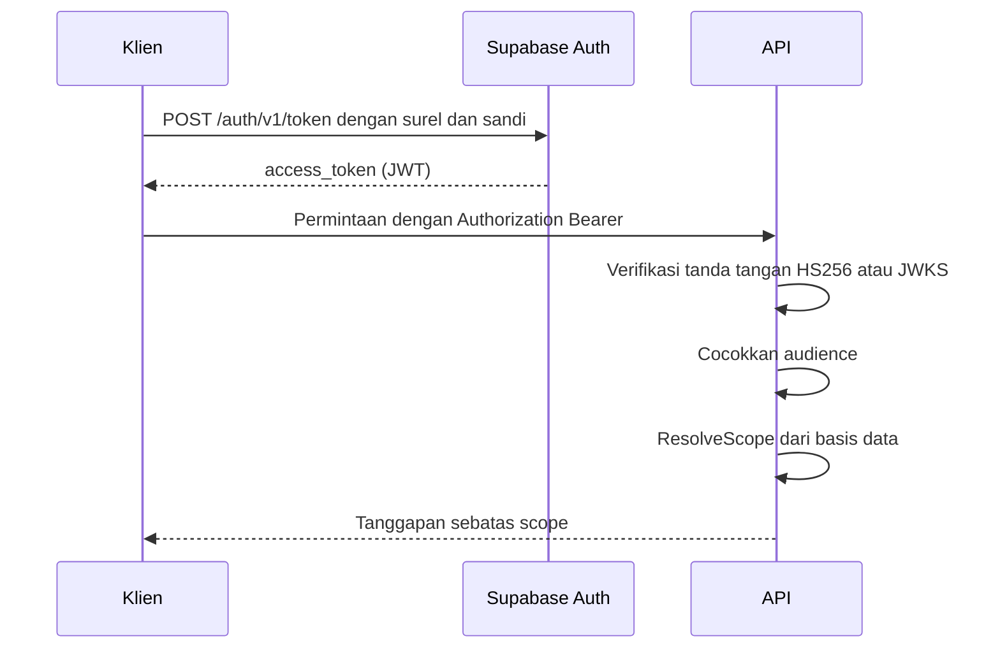

# 7. API Documentation

Seluruh rute dibaca dari `backend/internal/httpapi/router.go`.

## 7.1 Dasar

| Aspek | Nilai |
|---|---|
| Alamat dasar | `https://api.salesan.marseltech.cloud/api/v1` |
| Format | JSON, kecuali unggahan berkas yang memakai `multipart/form-data` |
| Autentikasi | `Authorization: Bearer <JWT Supabase>` |
| Pemeriksaan kesehatan | `GET /health`, tanpa autentikasi |
| WebSocket | `GET /api/v1/ws` |

## 7.2 Authentication



Dua hal yang perlu diketahui integrator:

1. **Peran tidak dibaca dari JWT.** Token hanya membuktikan identitas. Peran dan
   jangkauan akses dihitung ulang dari basis data pada tiap permintaan.
2. **Dua rute tanpa autentikasi:** `GET /health` dan `GET /api/v1/media/{token}`.
   Yang kedua dijaga oleh tanda tangan pada token itu sendiri, berbatas waktu
   `MEDIA_URL_TTL`.

## 7.3 Endpoint list

### Identitas

| Method | Path | Keterangan |
|---|---|---|
| GET | `/me` | Pengguna, workspace, dan scope-nya |

### Aplikasi — Leader saja

| Method | Path | Keterangan |
|---|---|---|
| GET | `/applications` | Daftar aplikasi |
| POST | `/applications` | Buat aplikasi |
| PATCH | `/applications/{id}` | Ubah aplikasi |
| DELETE | `/applications/{id}` | Hapus aplikasi |
| POST | `/applications/{id}/icon` | Unggah ikon |
| DELETE | `/applications/{id}/icon` | Hapus ikon |

### Akun WhatsApp

| Method | Path | Keterangan |
|---|---|---|
| GET | `/accounts` | Daftar nomor beserta hitungan percakapan dan pesan |
| POST | `/accounts` | Daftarkan nomor baru |
| GET | `/accounts/stats` | Ringkasan status koneksi |
| GET | `/accounts/{id}` | Satu nomor |
| PATCH | `/accounts/{id}` | Ubah nama, label, aplikasi |
| DELETE | `/accounts/{id}` | Hapus nomor beserta turunannya |
| POST | `/accounts/{id}/pair` | Mulai pemindaian QR |
| GET | `/accounts/{id}/qr` | Ambil kode QR terkini |
| POST | `/accounts/{id}/connect` | Sambungkan ulang |
| POST | `/accounts/{id}/disconnect` | Putuskan tanpa keluar |
| POST | `/accounts/{id}/logout` | Keluar dari WhatsApp |
| POST | `/accounts/{id}/sync` | Tarik kontak, grup, riwayat |

### Percakapan dan pesan

| Method | Path | Keterangan |
|---|---|---|
| GET | `/accounts/{id}/conversations` | Daftar percakapan, mendukung `q`, label, dan saringan status |
| GET | `/accounts/{id}/conversations/counts` | Hitungan untuk lencana |
| GET | `/conversations/{id}` | Satu percakapan |
| PATCH | `/conversations/{id}` | Ubah status, arsip, sematan |
| DELETE | `/conversations/{id}` | Hapus percakapan |
| POST | `/conversations/{id}/read` | Tandai sudah dibaca |
| POST | `/conversations/{id}/unread` | Tandai belum dibaca |
| GET | `/conversations/{id}/messages` | Daftar pesan, berhalaman |
| POST | `/conversations/{id}/messages` | Kirim teks |
| POST | `/conversations/{id}/media` | Kirim media, `multipart/form-data` |
| POST | `/conversations/{id}/quick-replies/{quickReplyID}` | Kirim balas cepat bergambar |
| POST | `/conversations/{id}/polls` | Buat polling |
| POST | `/conversations/{id}/labels` | Pasang label |
| DELETE | `/conversations/{id}/labels/{labelID}` | Lepas label |
| GET | `/conversations/{id}/members` | Anggota grup |
| POST | `/conversations/{id}/members` | Ubah anggota grup |
| POST | `/conversations/{id}/group/refresh` | Tarik ulang info grup |
| PATCH | `/conversations/{id}/group` | Ubah nama atau deskripsi grup |
| GET | `/conversations/{id}/first-mention` | Sebutan pertama yang belum dilihat |

### Operasi pada satu pesan

| Method | Path | Keterangan |
|---|---|---|
| PATCH | `/messages/{id}` | Ubah pesan terkirim |
| DELETE | `/messages/{id}` | Hapus untuk semua |
| POST | `/messages/{id}/forward` | Teruskan |
| GET | `/messages/{id}/private-reply` | Tujuan japri dari anggota grup |
| POST | `/messages/{id}/private-reply` | Kirim japri |
| POST | `/messages/{id}/react` | Beri reaksi |
| POST | `/messages/{id}/vote` | Pilih pada polling |

### Status WhatsApp

| Method | Path | Keterangan |
|---|---|---|
| GET | `/accounts/{id}/status` | Status yang masih hidup |
| POST | `/status/{messageID}/seen` | Tandai sudah dilihat, lokal saja |
| POST | `/status/{messageID}/revoke` | Tarik Status sendiri |

### Label percakapan

| Method | Path | Keterangan |
|---|---|---|
| GET | `/accounts/{id}/labels` | Daftar label |
| POST | `/accounts/{id}/labels` | Buat label |
| PATCH | `/accounts/{id}/labels/{id}` | Ubah label |
| DELETE | `/accounts/{id}/labels/{id}` | Hapus label |

### Kontak

| Method | Path | Keterangan |
|---|---|---|
| GET | `/contacts` | Daftar kontak, berhalaman |
| GET | `/contacts/facets` | Nilai untuk saringan |
| GET | `/contacts/export` | Ekspor CSV |
| POST | `/contacts/import` | Impor CSV |
| POST | `/contacts/merge-duplicates` | Gabungkan kontak ganda |
| POST | `/contacts/delete` | Hapus massal |
| DELETE | `/contacts/{id}` | Hapus satu |

### Grup

| Method | Path | Keterangan |
|---|---|---|
| GET | `/groups` | Direktori grup lintas nomor |
| GET | `/groups/facets` | Nilai untuk saringan |
| GET | `/groups/members` | Anggota lintas grup |
| GET | `/groups/members/export` | Ekspor anggota |
| GET | `/groups/export` | Ekspor grup |
| POST | `/groups/refresh` | Segarkan satu grup |
| POST | `/groups/fetch` | Tarik grup dari perangkat |

### Kampanye

| Method | Path | Keterangan |
|---|---|---|
| GET | `/campaigns` | Daftar, dengan saringan |
| POST | `/campaigns` | Buat kampanye |
| POST | `/campaigns/preview` | Pratinjau penerima, tidak menulis apa pun |
| GET | `/campaigns/audiences` | Sumber penerima yang tersedia |
| POST | `/campaigns/draft` | Susun draf dengan GPT, opsional |
| POST | `/campaigns/documents` | Unggah dokumen lampiran |
| GET | `/campaigns/facets` | Nilai untuk saringan |
| GET | `/campaigns/{id}` | Satu kampanye |
| GET | `/campaigns/{id}/source` | Sumber penerima yang tersimpan |
| PUT | `/campaigns/{id}` | Ubah kampanye |
| POST | `/campaigns/{id}/schedule` | Jadwalkan |
| POST | `/campaigns/{id}/run` | Jalankan sekarang |
| POST | `/campaigns/{id}/cancel` | Batalkan |
| POST | `/campaigns/{id}/retry` | Ulangi yang gagal |
| POST | `/campaigns/{id}/resend` | Kirim ulang seluruhnya |
| POST | `/campaigns/{id}/archive` | Arsipkan |
| DELETE | `/campaigns/{id}` | Hapus |
| GET | `/campaigns/{id}/report` | Laporan ringkas |
| GET | `/campaigns/{id}/targets` | Daftar penerima |
| GET | `/campaigns/{id}/targets/export` | Ekspor penerima |
| PUT | `/campaigns/{id}/labels` | Pasang label kampanye |
| POST | `/campaigns/{id}/publications/{publicationID}/revoke` | Tarik satu Story |

### Balas cepat

| Method | Path | Keterangan |
|---|---|---|
| GET | `/quick-replies` | Daftar |
| POST | `/quick-replies` | Buat atau ubah |
| DELETE | `/quick-replies` | Hapus semua |
| GET | `/quick-replies/export` | Ekspor |
| POST | `/quick-replies/import` | Impor |
| POST | `/quick-replies/{id}/used` | Catat pemakaian |
| DELETE | `/quick-replies/{id}` | Hapus satu |

### Analitik

| Method | Path | Keterangan |
|---|---|---|
| GET | `/dashboard` | Ringkasan periode |
| GET | `/performance` | Performa sesuai scope |
| GET | `/performance/team` | Rekap tim |
| GET | `/performance/by-application` | Rincian per aplikasi |
| GET | `/performance/members` | Rincian per anggota |
| GET | `/analytics/traffic` | Lalu lintas pesan |
| GET | `/analytics/filters` | Nilai untuk saringan |
| GET | `/analytics/activity` | Riwayat aktivitas |
| GET | `/analytics/conversation-location` | Sebaran lokasi |
| GET | `/analytics/messages` | Telusur pesan |
| GET | `/analytics/sla` | Telusur SLA |
| GET | `/analytics/follow-ups` | Telusur follow up |
| GET | `/analytics/group-mentions` | Telusur sebutan grup |
| GET | `/analytics/label-events` | Telusur perubahan label |
| GET | `/analytics/leads` | Telusur lead |

### Organisasi — Leader saja

| Method | Path | Keterangan |
|---|---|---|
| GET | `/org/members` | Daftar anggota |
| POST | `/org/members` | Tambah anggota |
| PATCH | `/org/members/{id}/role` | Tetapkan peran operasional |
| PATCH | `/org/members/{id}/assignments` | Tetapkan penugasan aplikasi |
| PATCH | `/org/members/{id}/active` | Aktifkan atau nonaktifkan |
| PATCH | `/org/members/{id}/password` | Ubah sandi |

### Pengaturan lain

| Method | Path | Keterangan |
|---|---|---|
| GET/POST/DELETE | `/sla-targets` | Target SLA per aplikasi |
| GET/POST/DELETE | `/schedules` | Jam kerja |
| GET/POST/DELETE | `/custom-variables` | Variabel pesan |
| GET/POST/PATCH | `/campaign-labels` | Label kampanye |
| GET | `/attachments/{id}/url` | Tautan bertanda tangan untuk satu lampiran |
| GET | `/media/{token}` | Sajikan media, tanpa autentikasi, dijaga tanda tangan |

### Newsletter

| Method | Path | Keterangan |
|---|---|---|
| GET | `/accounts/{id}/newsletters` | Daftar saluran |
| POST | `/accounts/{id}/newsletters/sync` | Tarik saluran |
| GET | `/accounts/{id}/newsletters/posts` | Kiriman |
| GET | `/accounts/{id}/newsletters/media` | Media kiriman |
| POST | `/accounts/{id}/newsletters/action` | Ikuti, berhenti, bisukan |
| POST | `/accounts/{id}/newsletters/post` | Kirim teks |
| POST | `/accounts/{id}/newsletters/media` | Kirim media |

## 7.4 Contoh request dan response

### Kirim pesan teks

```http
POST /api/v1/conversations/{id}/messages
Authorization: Bearer <JWT>
Content-Type: application/json

{
  "body": "Halo, ada yang bisa kami bantu?",
  "reply_to": "0d4d7222-1111-2222-3333-444455556666"
}
```

```json
{
  "message": {
    "id": "8f3c...",
    "wa_message_id": "3EB0CB5AABB3EB88BCA669",
    "from_me": true,
    "type": "text",
    "status": "sent",
    "sender_source": "web_admin",
    "quoted": {
      "wa_message_id": "3EB0...",
      "sender_name": "Dinaeks",
      "from_me": false,
      "type": "text",
      "text": "pagii dengan siapa ?"
    }
  }
}
```

### Pratinjau penerima broadcast

```http
POST /api/v1/campaigns/preview
Content-Type: application/json

{
  "campaign_type": "broadcast",
  "name": "Promo September",
  "body": "Halo {{nama}}",
  "application_id": "...",
  "account_ids": ["..."],
  "target_source": "groups",
  "group_ids": ["...", "..."],
  "delay_profile": "normal",
  "run_now": true
}
```

```json
{
  "plan": {
    "valid": 31,
    "unreachable": 0,
    "duplicates": [],
    "problems": [
      {
        "input": "TIM FIRYAL",
        "reason": "ini komunitas, bukan grup chat; pilih grup di dalam komunitas tersebut"
      }
    ],
    "devices": [{ "name": "HP GRUP 1", "count": 31 }],
    "missing_variables": [],
    "template_problems": []
  }
}
```

## 7.5 Error handling

Bentuk galat seragam:

```json
{
  "error": "kode_mesin",
  "message": "Kalimat untuk operator, berbahasa Indonesia",
  "data": {}
}
```

`data` opsional dan hanya muncul bila ada rincian yang bisa dibaca mesin.

### Pemetaan galat domain ke status HTTP

| Galat domain | Status | Kode |
|---|---|---|
| `ErrNotFound` | 404 | `not_found` |
| `ErrForbidden` | 403 | `forbidden` |
| Badan permintaan tidak sah | 400 | `invalid_body` |
| Id tidak sah | 400 | `invalid_id` |
| Tidak ada penerima | 400 | `no_recipients` |
| Media tidak bisa diambil | 502 | `invalid_media` |
| Unggahan gagal | 502 | `upload_failed` |
| GPT gagal | 502 | `gpt_failed` |
| Kirim ke kanal gagal | 502 | `channel_send_failed` |

Lebih dari 25 kode galat dipakai, semuanya berupa potongan kata kecil dengan
garis bawah. Pesan yang menyertainya ditulis untuk dibaca operator, bukan
developer.

### Pola khusus: pengiriman gagal tetapi baris tersimpan

Beberapa rute pengiriman menjawab `200` dengan badan yang memuat pesan **dan**
galat sekaligus:

```json
{
  "message": { "id": "...", "status": "failed" },
  "error": "send_failed",
  "detail": "..."
}
```

Ini disengaja. Baris pesannya sudah ada di utas dan harus ditampilkan; yang
gagal adalah pengirimannya ke WhatsApp. Klien perlu menangani bentuk ini.

---

## Ringkasan yang belum tersedia

| Butir | Siapa yang memegang jawabannya |
|---|---|
| Spesifikasi OpenAPI/Swagger | Belum dibuat |
| Pembatasan laju permintaan (rate limit) | Belum diterapkan |
| Penomoran versi API selain `/v1` | Arsitek |
