# 8. Development Documentation

## 8.1 Repository structure

```
SALESANv2/
├── backend/                  Go 1.27
│   ├── cmd/
│   │   ├── server/           Proses utama: API, WebSocket, worker
│   │   ├── migrate/          Pelaksana migration
│   │   ├── dbcheck/          Pemeriksaan basis data
│   │   ├── analyticscheck/   Pemeriksaan angka analitik
│   │   ├── newmember/        Membuat anggota dari baris perintah
│   │   ├── delmember/        Menghapus anggota
│   │   ├── setpassword/      Mengubah sandi
│   │   └── appicons/         Menyiapkan ikon aplikasi
│   ├── internal/             14 paket, 126 berkas, 45.179 baris
│   ├── migrations/           67 berkas SQL bernomor
│   └── .env.example          44 environment variable
├── web/                      Next.js 15
│   ├── src/app/              22 rute halaman
│   ├── src/components/       8 folder komponen
│   ├── src/lib/              Klien API, realtime, tipe
│   ├── src/middleware.ts     Penjaga sesi
│   └── .env.example          3 environment variable
├── deploy/                   Berkas Docker Compose, nginx, skrip
├── docs/                     Dokumentasi
├── DESIGN.md                 Arahan desain, ditulis pemilik produk
└── README.md                 Panduan setup lokal
```

## 8.2 Coding convention

Konvensi berikut tidak tertulis sebagai aturan formal, tetapi dipegang
konsisten di seluruh kode dan sebaiknya diikuti.

### Go

| Konvensi | Contoh |
|---|---|
| Seluruh SQL berada di `internal/repository` | Tidak ada paket lain yang memanggil `pool.Query` |
| Galat domain dipetakan terpusat | `writeAppError` menerjemahkan ke status HTTP |
| Pesan galat untuk operator berbahasa Indonesia | "Data ini berada di luar aplikasi yang ditugaskan kepada akun Anda" |
| Komentar menjelaskan **mengapa**, bukan **apa** | Komentar panjang di `runner.go` merekam kejadian produksi yang memicu perubahan |
| Nilai konfigurasi selalu punya bawaan | `duration("CAMPAIGN_LEASE", 10*time.Minute)` |
| Berkas sementara dihapus di setiap jalan keluar | `defer` pada `os.Remove` |
| Uji menjelaskan perilaku, bukan implementasi | `TestFollowUpNotCountedOnFirstContact` |

### TypeScript

| Konvensi | Contoh |
|---|---|
| Seluruh panggilan API lewat `lib/api.ts` | Tidak ada `fetch` langsung di komponen |
| SWR satu-satunya cache | Tidak ada penyimpan status global lain |
| Peristiwa realtime memicu `mutate`, tidak menulis data | `useRealtimeEvent` |
| Tipe dibagikan lewat `lib/types.ts` | `Message`, `Conversation`, `Me` |

### Commit

Pesan commit di repositori ini menjelaskan **persoalan yang diselesaikan** dan
bukti pengukurannya, bukan sekadar berkas yang diubah. Contoh yang ada:

> `Speed: index the session lookups every send waits on, and stop queueing on four connections`

Baris atribusi ditambahkan di akhir sesuai ketentuan proyek.

## 8.3 Environment setup

### Prasyarat

| Kebutuhan | Versi |
|---|---|
| Go | 1.27 atau lebih baru |
| Node.js | 22 |
| PostgreSQL | Lewat Supabase, lokal atau hosted |
| Docker | Opsional, untuk menjalankan seluruhnya sekaligus |

### Langkah

```bash
# 1. Basis data
cd backend
cp .env.example .env          # isi DATABASE_URL dan kunci Supabase
go run ./cmd/migrate

# 2. Backend
go run ./cmd/server           # mendengar di :8080

# 3. Frontend
cd ../web
cp .env.example .env.local    # isi NEXT_PUBLIC_API_URL dan kunci Supabase
npm install
npm run dev                   # mendengar di :3000
```

Panduan lebih rinci, termasuk penyiapan Supabase, ada di
[`README.md`](../../README.md).

### Environment variable yang wajib diisi

| Variabel | Untuk apa |
|---|---|
| `DATABASE_URL` | Koneksi PostgreSQL |
| `SUPABASE_URL` | Alamat Supabase |
| `SUPABASE_JWT_SECRET` atau `SUPABASE_JWKS_URL` | Verifikasi token |
| `SUPABASE_SERVICE_ROLE_KEY` | Akses Storage dari backend |
| `NEXT_PUBLIC_API_URL` | Alamat API dari peramban |
| `NEXT_PUBLIC_SUPABASE_URL`, `NEXT_PUBLIC_SUPABASE_ANON_KEY` | Masuk dari peramban |

> `SUPABASE_SERVICE_ROLE_KEY` melewati seluruh pembatasan baris. Kunci ini tidak
> boleh masuk ke frontend, ke kode sumber, ke log, atau ke variabel berawalan
> `NEXT_PUBLIC_`.

## 8.4 Development workflow

```mermaid
flowchart LR
    A[Ubah kode] --> B[Verifikasi lokal]
    B --> C[Commit]
    C --> D[Push ke main]
    D --> E[SSH ke VPS]
    E --> F[bash deploy/deploy.sh]
    F --> G[git pull]
    G --> H[docker compose build]
    H --> I[Jalankan migration]
    I --> J[docker compose up -d]
    J --> K[Verifikasi di produksi]
```



### Verifikasi lokal sebelum commit

```bash
# Backend
cd backend
gofmt -l internal/            # harus kosong untuk berkas yang diubah
go build ./...
go vet ./internal/...
go test ./internal/...

# Frontend
cd ../web
npx tsc --noEmit
npm run lint
npm run build:check
```

`npm run build:check` adalah pembungkus aman di sekitar `next build`; pakai itu,
bukan `next build` langsung.

### Menambah migration

1. Buat berkas `backend/migrations/00NN_nama_singkat.sql` dengan nomor berikutnya.
2. Tulis komentar di awal yang menjelaskan **mengapa** migration ini ada, bukan
   hanya apa yang diubahnya. Seluruh migration yang ada mengikuti pola ini.
3. Pastikan aman dijalankan ulang: pakai `if not exists` dan `add column if not exists`.
4. Uji coba dulu di dalam transaksi yang di-`rollback` sebelum dipasang.
5. Migration berjalan otomatis saat deploy.

### Yang tidak boleh dilakukan

| Larangan | Alasan |
|---|---|
| Mereset repositori atau membuang perubahan pengguna | Kehilangan pekerjaan |
| Menjalankan migration destruktif | Riwayat pengiriman dan performa tidak boleh hilang |
| Memakai data contoh atau dummy di produksi | Angka harus nyata |
| Menyimpan base64 atau biner di basis data | Media disimpan di bucket privat |
| Memalsukan perilaku manusia terhadap WhatsApp | Keputusan produk yang tercatat |

## 8.5 Utilitas baris perintah

| Perintah | Kegunaan |
|---|---|
| `go run ./cmd/migrate` | Jalankan migration yang belum terpasang |
| `go run ./cmd/dbcheck` | Periksa kesehatan basis data |
| `go run ./cmd/analyticscheck` | Bandingkan angka analitik |
| `go run ./cmd/newmember` | Tambah anggota tim |
| `go run ./cmd/delmember` | Hapus anggota tim |
| `go run ./cmd/setpassword` | Ubah sandi anggota |
| `go run ./cmd/appicons` | Siapkan ikon aplikasi |

---

## Ringkasan yang belum tersedia

| Butir | Siapa yang memegang jawabannya |
|---|---|
| Aturan penulisan kode yang formal | Tim developer |
| Integrasi berkelanjutan (CI) | Belum ada |
| Panduan penelaahan kode (code review) | Tim developer |
| Aturan penamaan cabang git | Tim developer |
