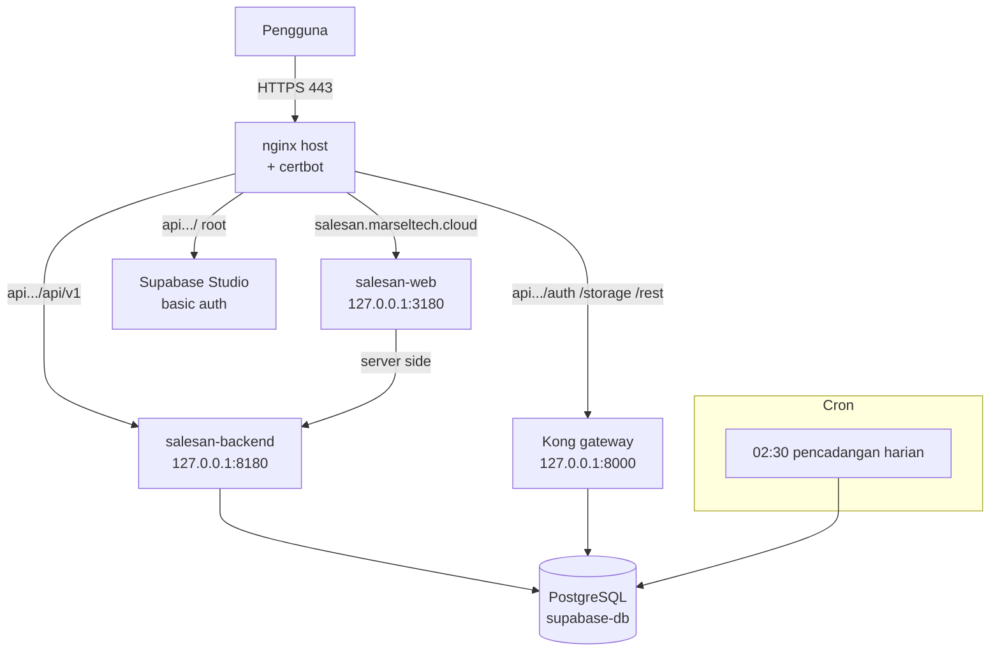
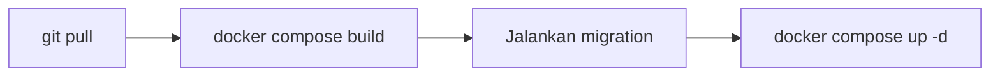

# 10. Deployment Documentation

## 10.1 Production architecture



| Komponen | Keterangan |
|---|---|
| Server | VPS Ubuntu, 4 inti, 15 GB RAM, `187.53.133.30` |
| Kode | Klon git di `/opt/salesan/app` |
| Kontainer aplikasi | `salesan-backend`, `salesan-web` |
| Kontainer Supabase | 11 kontainer di `/opt/supabase` |
| Penanda mode | Berkas `deploy/USE_NGINX` |
| Jaringan Docker | Kontainer aplikasi bergabung ke `supabase_default` |

Kedua kontainer aplikasi hanya mendengar di `127.0.0.1`. Tidak ada port
aplikasi yang terbuka ke internet; seluruh lalu lintas masuk lewat nginx.

## 10.2 Server configuration

### nginx

Berkas contoh ada di `deploy/nginx-site.conf`, terpasang sebagai
`/etc/nginx/sites-enabled/salesan-id`.

| Pola | Tujuan | Catatan |
|---|---|---|
| `= /health` | backend 8180 | Pemeriksaan kesehatan |
| `/api/v1/ws` | backend 8180 | Dengan header upgrade WebSocket |
| `^~ /api/v1/projects/` | gateway 8000 | Supabase Studio |
| `^~ /api/v1/` | backend 8180 | Batas waktu 660 detik |
| `~ ^/(auth\|storage\|rest\|realtime\|functions)/v1/` | gateway 8000 | Layanan Supabase |
| `/` pada hostname api | gateway 8000 | Studio, dijaga basic auth |
| `/` pada hostname aplikasi | web 3180 | Next.js |

Batas waktu 660 detik ada karena beberapa operasi, misalnya menarik grup dari
perangkat, memang berjalan lama.

Peta upgrade WebSocket dipasang terpisah di `/etc/nginx/conf.d/upgrade-map.conf`.

### Basis data

| Pengaturan | Nilai |
|---|---|
| `max_connections` | 100 |
| Kumpulan koneksi aplikasi | 16 |
| Kumpulan koneksi whatsmeow | 16 |
| Dipakai layanan Supabase | sekitar 25 |
| Sisa untuk migration dan diagnosis | sekitar 43 |

Angka 16 dan 16 berlaku sejak basis data pindah ke VPS. Sebelumnya 8 dan 4,
mengikuti batas 15 klien pada pooler Supabase hosted yang sudah tidak berlaku.

## 10.3 Environment variable

Backend membaca 44 variabel. Yang penting:

### Wajib

| Variabel | Keterangan |
|---|---|
| `DATABASE_URL` | Koneksi PostgreSQL |
| `SUPABASE_URL` | Alamat Supabase |
| `SUPABASE_JWT_SECRET` / `SUPABASE_JWKS_URL` | Verifikasi token |
| `SUPABASE_SERVICE_ROLE_KEY` | Akses Storage dari backend |
| `ALLOWED_ORIGINS` | Asal yang boleh memanggil API |
| `PUBLIC_API_URL` | Alamat API untuk tautan media |

### Perilaku WhatsApp

| Variabel | Bawaan | Keterangan |
|---|---|---|
| `QR_TIMEOUT` | — | Batas waktu pemindaian QR |
| `RECONNECT_BASE_DELAY` / `RECONNECT_MAX_DELAY` | — | Backoff sambung ulang |
| `WA_AUTO_MARK_READ` | — | Tandai terbaca otomatis |
| `WA_HUMANIZE`, `WA_PRESENCE_ONLINE`, `WA_TYPING_*`, `WA_SEND_MIN_GAP` | — | Pacing pengiriman |

### Kampanye

| Variabel | Bawaan | Keterangan |
|---|---|---|
| `CAMPAIGN_POLL_INTERVAL` | `5s` | Jeda penjadwal |
| `CAMPAIGN_LEASE` | `10m` | Lama klaim |
| `CAMPAIGN_CONCURRENCY` | `4` | Kampanye paralel |
| `CAMPAIGN_SEND_CONCURRENCY` | `6` | Penerima yang dikirimi serentak |
| `CAMPAIGN_STORY_CONCURRENCY` | `3` | Nomor yang menerbitkan Story serentak |
| `CAMPAIGN_SEND_TIMEOUT` | `2m` | Batas satu pengiriman |
| `CAMPAIGN_STORY_TIMEOUT` | `45m` | Batas satu penerbitan Story |
| `CAMPAIGN_OFFLINE_GRACE` | `30m` | Lama semua nomor boleh putus sebelum gagal |
| `CAMPAIGN_MEDIA_MAX_BYTES` | `67108864` | Batas unduhan media |
| `CAMPAIGN_MEDIA_TIMEOUT` | `2m` | Batas waktu unduhan |

### Pengukuran

| Variabel | Bawaan | Keterangan |
|---|---|---|
| `SLA_TARGET_SECONDS` | — | Target balas bawaan |
| `SLA_BUSINESS_HOURS` | `false` | Hitung hanya di jam kerja |
| `FOLLOWUP_GAP` | `6h` | Lama sepi sebelum dihitung follow up |
| `METRICS_RECONCILE_INTERVAL` | `15m` | Jeda sapuan perbaikan angka |

### Frontend

| Variabel | Keterangan |
|---|---|
| `NEXT_PUBLIC_API_URL` | Alamat API |
| `NEXT_PUBLIC_SUPABASE_URL` | Alamat Supabase |
| `NEXT_PUBLIC_SUPABASE_ANON_KEY` | Kunci publik untuk masuk |

> Hanya kunci anon yang boleh berawalan `NEXT_PUBLIC_`. Kunci service role
> melewati seluruh pembatasan baris dan tidak boleh sampai ke peramban.

## 10.4 Deployment process

```bash
ssh root@187.53.133.30
cd /opt/salesan/app
bash deploy/deploy.sh
```

Yang dilakukan skrip itu:



Migration dijalankan dengan `--entrypoint /app/migrate` pada citra backend,
sebelum kontainer baru dinyalakan.

### Sebelum deploy

| Periksa | Perintah |
|---|---|
| Tidak ada Story yang sedang terbit | `select count(*) from story_publications where status='processing'` |
| Tidak ada broadcast yang sedang mengirim | `select count(*) from campaign_targets where status='processing'` |

Restart memutus pengiriman yang sedang berjalan. Antrean memulihkannya sendiri
setelah lease habis, tetapi menunggu antrean kosong lebih rapi.

### Sesudah deploy

| Periksa | Cara |
|---|---|
| Kontainer sehat | `docker ps --filter name=salesan` |
| Versi benar | `git log --oneline -1` di `/opt/salesan/app` |
| Tidak ada yang tersangkut | Kueri target dan publikasi berstatus `processing` dengan lease kedaluwarsa |
| Galat mereda | `docker logs salesan-backend --since 5m` |

### Biaya restart yang perlu diketahui

Setiap restart membuat 31 nomor menyambung ulang serentak. Pada ledakan itu
sebagian pesan masuk gagal disimpan karena kehabisan waktu tunggu 20 detik,
dan beban mesin sempat naik sampai sekitar 8. Keduanya mereda dalam beberapa
menit. Pada jendela tenang, angkanya nol.

Karena itu deploy berulang kali dalam waktu singkat sebaiknya dihindari.

## 10.5 Backup strategy

| Aspek | Nilai |
|---|---|
| Jadwal | Cron harian pukul 02:30 |
| Skrip | `deploy/backup-db.sh` |
| Cara | `pg_dump -F c -n public -n auth -n storage` lewat `docker exec supabase-db` |
| Lokasi | `/opt/salesan/backups` |
| Retensi | 14 hari |

Skrip pemulihan tersedia di `/opt/salesan/migrate/`:

| Skrip | Kegunaan |
|---|---|
| `restore-db.sh` | Pulihkan basis data dari cadangan |
| `copy-media.sh` | Salin media antar lingkungan |
| `cutover.sh` | Perpindahan dari Supabase cloud ke self-hosted |

`[DATA BELUM TERSEDIA]` — Uji pemulihan terakhir kali dilakukan kapan, dan
berapa lama prosesnya, belum tercatat. Cadangan yang belum pernah diuji pulih
belum bisa disebut cadangan.

## 10.6 Akses Supabase Studio

Studio bisa dibuka di `https://api.salesan.marseltech.cloud/`, dijaga basic auth
pada nginx. Kredensialnya tidak dicantumkan di dokumen ini.

## 10.7 Pemantauan

`[DATA BELUM TERSEDIA]` — Tidak ada sistem pemantauan atau peringatan otomatis.
Pemeriksaan dilakukan manual lewat `docker logs` dan kueri basis data.

Indikator yang layak dipantau, diturunkan dari kejadian nyata pada sistem ini:

| Indikator | Ambang yang masuk akal | Mengapa |
|---|---|---|
| Penerima berstatus `processing` dengan lease kedaluwarsa | lebih dari 0 selama lebih dari 10 menit | Pernah ada pengiriman menggantung selamanya |
| Kampanye `running` dengan `cancel_requested` | lebih dari 0 | Pernah ada kampanye terdampar |
| Nomor berstatus `logged_out` | lebih dari 0 | Pengiriman dari nomor itu pasti gagal |
| Galat `persist incoming message` di luar jendela restart | lebih dari 0 | Pesan masuk hilang |
| Beban mesin | di atas 5 selama lebih dari 10 menit | Pernah menandakan kueri memindai seluruh tabel |

---

## Ringkasan yang belum tersedia

| Butir | Siapa yang memegang jawabannya |
|---|---|
| Uji pemulihan cadangan terakhir | Operasional |
| Pemantauan dan peringatan otomatis | DevOps |
| Rencana pemulihan bencana | Operasional |
| Lingkungan staging | Tim |
| Prosedur pengembalian versi (rollback) | Tim |
